# SiamRPN++ IR/Thermal Tracking — Fine-Tuning & Deployment Pipeline

Fine-tunes **SiamRPN++** (ResNet-50 backbone, FPN neck, multi-scale RPN head) on 9 IR/thermal datasets covering UAV tracking, maritime, aerial wildlife, and road scenes. Outputs two ONNX models for edge deployment on the [Axelera Voyager](https://www.axelera.ai) platform.

Built on [PySOT](https://github.com/STVIR/pysot). Designed to run on AWS GPU instances (CUDA 11.8).

---

## Table of Contents

1. [Background: From Detection to Tracking](#1-background-from-detection-to-tracking)
2. [Architecture: How SiamRPN++ Works](#2-architecture-how-siamrpn-works)
3. [Training: How It Differs from YOLO](#3-training-how-it-differs-from-yolo)
4. [Quick Start](#4-quick-start)
5. [Datasets](#5-datasets)
6. [Training Details](#6-training-details)
7. [Multi-GPU Training (DDP)](#7-multi-gpu-training-ddp)
8. [ONNX Export](#8-onnx-export)
9. [Evaluation](#9-evaluation)
10. [Demo Videos](#10-demo-videos)
11. [Inference Hyperparameters](#11-inference-hyperparameters)
12. [Directory Layout](#12-directory-layout)
13. [Operations & Advanced](#13-operations--advanced)
14. [Changelog & Development Notes](#14-changelog--development-notes)
15. [Training Bug: Dataset Preprocessing Root Cause Analysis](#15-training-bug-dataset-preprocessing-root-cause-analysis)
16. [Model Comparison: Fine-tuned vs Official Pretrained](#16-model-comparison-fine-tuned-vs-official-pretrained)
17. [Debugging the Tracker](#17-debugging-the-tracker)
18. [Findings from Debug Analysis](#18-findings-from-debug-analysis)
19. [Recommendations](#19-recommendations)
20. [Advanced Tracker: Dual Template + Gallery](#20-advanced-tracker-dual-template--gallery)
21. [SAM-Based Video Segmentation](#21-sam-based-video-segmentation)
22. [Fix 1: Decoupling Search-Area Size from Bounding Box](#22-fix-1-decoupling-search-area-size-from-bounding-box)
23. [Stage 1: IR Backbone Fine-tuning](#23-stage-1-ir-backbone-fine-tuning)

---

## 1. Background: From Detection to Tracking

If you are familiar with YOLO-style detection, the key mental shift is this:

> **Detection** asks *"what objects are in this image?"*
> **Tracking** asks *"where did this specific object go in the next frame?"*

A YOLO model is trained to recognise categories (car, person, drone). At inference it scans a single image and outputs all bounding boxes by class. It has no memory — each frame is processed in isolation.

A **visual tracker** does something fundamentally different. You give it one reference image of a target — called the **template** — and it continuously localises that same instance across subsequent video frames, regardless of what category it belongs to. It never needs to know if the target is a drone, a bird, or a boat. It just asks: *"does this patch of pixels look like my template?"*

This distinction matters for IR/thermal deployment:
- IR imagery lacks the colour and texture cues that category-based detectors rely on.
- You often want to track a specific intruder drone, not detect all drones in the scene.
- Trackers are more robust to domain shift because they match appearance, not a learned class prototype.

---

## 2. Architecture: How SiamRPN++ Works

SiamRPN++ is a **Siamese network** — two branches sharing the same backbone weights that process two inputs simultaneously.

```
Template (127×127 px)          Search Region (255×255 px)
        │                                │
   ┌────▼────┐                      ┌────▼────┐
   │Backbone │  ResNet-50 + FPN     │Backbone │  (shared weights)
   └────┬────┘                      └────┬────┘
        │  zf (3 scales)                 │  xf (3 scales)
        │                                │
        └──────────┬─────────────────────┘
                   │
        ┌──────────▼──────────┐
        │  DW-XCorr per scale │  Depth-wise cross-correlation
        └──────────┬──────────┘
                   │  response maps
        ┌──────────▼──────────┐
        │     RPN Head        │  cls + loc branches
        └──────────┬──────────┘
                   │
        ┌──────────┴──────────┐
        │  cls (1,10,25,25)   │  ← 5 anchors × 2 (fg/bg) × 25×25 grid
        │  loc (1,20,25,25)   │  ← 5 anchors × 4 (dx,dy,dw,dh) × 25×25 grid
        └─────────────────────┘
```

### Key components

**Siamese backbone (shared weights)**
Both the template and search crops pass through the same ResNet-50. Because the weights are shared, both branches learn the same feature representation — similarity in feature space corresponds to visual similarity in image space.

**FPN neck (multi-scale)**
A Feature Pyramid Network aggregates features from layers 2, 3, and 4 of ResNet-50, giving three feature scales `zf_0 / zf_1 / zf_2`. This helps handle targets at different scales.

**Depth-wise cross-correlation (DW-XCorr)**
This is the core of the Siamese approach. The template features `zf` act as a *learned sliding filter* that is convolved over the search features `xf`. Positions in the resulting response map with high activation indicate where the search region looks most similar to the template.

In YOLO terms: instead of a fixed classifier head reading from backbone features, SiamRPN++ uses the *template itself* as a dynamic query kernel. The backbone learns to produce feature maps where cross-correlation naturally peaks at the target location.

**RPN head (same concept as YOLO)**
A region proposal network identical in spirit to what Faster-RCNN and YOLOv2+ use — a 25×25 spatial grid, 5 anchor aspect ratios per location (0.33, 0.5, 1.0, 2.0, 3.0), each predicting:
- `cls`: is this anchor on the target (fg) or background (bg)?
- `loc`: dx, dy, dw, dh offsets to refine the anchor to the exact box.

Total anchors per frame: 25 × 25 × 5 = **3,125** — all evaluated in a single forward pass.

### At inference

1. **Initialisation (once per target):** Crop the target from the first frame → run through the template encoder → cache `zf_0 / zf_1 / zf_2`.
2. **Every frame:** Crop a 255×255 search region centred on the last known position → run through the tracker model with the cached `zf` → decode the highest-scoring anchor → update position.

This is why export produces **two separate ONNX models** — the template encoder runs once, the tracker runs every frame.

---

## 3. Training: How It Differs from YOLO

| Aspect | YOLO training | SiamRPN++ training |
|--------|--------------|-------------------|
| Input | Single image per sample | (template crop, search crop) pair from the same video |
| Label | Class ID + bbox per object | Binary fg/bg + bbox for the *one* tracked object |
| Loss | Multi-class CE + box regression | Binary CE (focal) + smooth-L1 (same as RPN) |
| Dataset | Images with annotations | Video sequences with per-frame bbox tracks |
| Category awareness | Yes — 80 COCO classes | None — similarity-based, category-agnostic |
| Epoch structure | One pass through the dataset | Fixed budget of N random (template, search) pairs |
| Batch item | One image | One (z, x) pair sampled from a random sequence |

### Why pairs, not full frames?

The Siamese network must learn what *similarity* looks like, not what categories look like. To create a training signal, you need two crops of the same object:
- **Template** `z`: a 127×127 crop centred on the target with 0.5× context padding at frame `t`.
- **Search region** `x`: a 255×255 crop centred near the same target at frame `t + δ` (δ = 1–100 frames), with the target potentially shifted, scaled, or partially occluded.

The model must output high classification scores and accurate offsets at the anchor overlapping the target in `x`, and low scores everywhere else. All other anchors are background.

### Loss

```
L_total = L_cls + λ · L_loc

L_cls = Binary cross-entropy (weighted: ignore anchors with IoU 0.3–0.6, 
                                         positive: IoU > 0.6, 
                                         negative: IoU < 0.3)
L_loc = Smooth-L1 on (dx, dy, dw, dh) for positive anchors only
λ     = 1.2   (balances classification vs. localisation)
```

---

## 4. Quick Start

```bash
# 1. Clone this repo
git clone https://github.com/jde-axelera/siamrpn_training.git
cd siamrpn_training

# 2. Clone PySOT alongside
git clone https://github.com/STVIR/pysot.git

# 3. Run the full pipeline (downloads data, installs deps, trains, exports)
chmod +x run_aws_training.sh
./run_aws_training.sh
```

On AWS instances with a small root partition, redirect everything to a data volume:

```bash
./run_aws_training.sh --install-dir=/data
```

**Verify setup first** (smoke test — 1 epoch, no downloads):

```bash
./run_aws_training.sh --smoke-test
```

**Resume from a checkpoint:**

```bash
./run_aws_training.sh --resume pysot/snapshot/all_datasets/checkpoint_epoch050.pth
```

### Pipeline scripts

| Step | Script | Purpose |
|------|--------|---------|
| Full pipeline | `run_aws_training.sh` | Orchestrates all steps end-to-end |
| Training | `train_siamrpn_aws.py` | Multi-GPU fine-tuning with SGDR + early stopping |
| Export | `export_onnx.py` | Converts best checkpoint → two ONNX models |
| Evaluate | `eval_onnx.py` | IoU / AUC metrics on test splits |
| Monitor | `monitor_training.sh` | Auto-evaluates every 25 epochs during training |
| Demo | `run_onnx_tracker.py` | Annotated MP4 with GT + predicted boxes |
| GT demo | `make_test_demo.py` | Ground-truth-only demo video from test splits |
| Report | `generate_report.py` | Multi-page PDF training report |

---

## 5. Datasets

Nine IR/thermal datasets are used. All annotations are automatically converted to a unified PySOT JSON format during the pipeline setup step.

### Dataset inventory

| # | Dataset | Size | Domain | Source |
|---|---------|------|--------|--------|
| 1 | **Anti-UAV410** | 410 seqs, 9.4 GB | IR UAV tracking | Google Drive (`gdown`) |
| 2 | **Anti-UAV300** | IR video sequences | IR UAV tracking | Google Drive (`gdown`) |
| 3 | **MSRS** | 1,444 image pairs | Paired IR/visible road | GitHub (`git clone` + LFS) |
| 4 | **VT-MOT / PFTrack** | 582 seqs, 401K frames | RGB+IR multi-object | Baidu Cloud (code: `chcw`) |
| 5 | **MassMIND** | 2,916 LWIR images | Maritime LWIR | Google Drive (`gdown`) |
| 6 | **MVSS-Baseline** | Video sequences | RGB-thermal video seg | Google Drive (author approval) |
| 7 | **DUT-VTUAV** | 500 seqs, 1.7M frames | RGB+Thermal UAV | Google Drive (rclone — see §12) |
| 8 | **BIRDSAI** | 48 TIR sequences | Aerial wildlife thermal | LILA (`wget`) |
| 9 | **HIT-UAV** | 2,898 IR images | High-altitude IR detection | Kaggle CLI |

Datasets missing their annotation JSON (VT-MOT, MVSS, AntiUAV300, BIRDSAI, HIT-UAV) are automatically excluded at training time and the remaining sampling weights are renormalised.

### Unified annotation format

All datasets are converted to a single JSON structure regardless of their original format (MOT `gt.txt`, YOLO normalised coords, segmentation masks, MP4 video):

```json
{
  "sequence_name": {
    "0": {
      "000001": [x1, y1, x2, y2],
      "000002": [x1, y1, x2, y2],
      ...
    }
  }
}
```

The outer `"0"` key represents the object track ID (always 0 for single-object tracking). Frame keys are zero-padded 6-digit integers. Coordinates are pixel-space `[x1, y1, x2, y2]`.

### Dataset annotation samples

Sample IR frames with ground-truth bounding boxes from each training dataset (4 sequences × 4 frames — full report at [`report/datasets_annotation_check.pdf`](report/datasets_annotation_check.pdf)):

**Anti-UAV 410** — IR UAV targets (tiny, high-altitude)
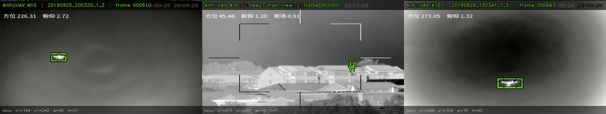

**MSRS** — Paired IR/visible road scenes (vehicles, pedestrians)
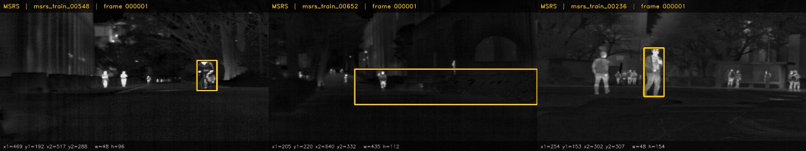

**MassMIND** — Maritime LWIR (vessels)
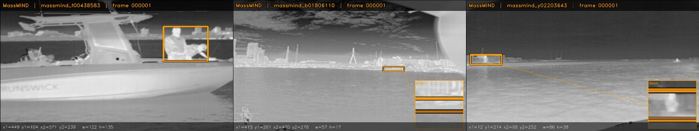

**DUT-VTUAV** — RGB+Thermal UAV (multi-category: vehicles, people, animals)
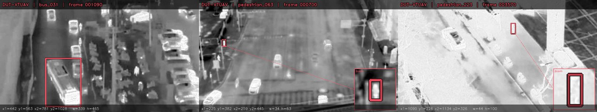

---

## 6. Training Details

### System requirements

| Component | Requirement |
|-----------|-------------|
| OS | Ubuntu 20.04+ |
| GPU | CUDA 11.8-compatible (AWS `g4dn` or `p3` recommended) |
| Storage | ≥ 300 GB on data partition (datasets + checkpoints) |

Python packages are installed automatically. Key dependencies: `torch + torchvision` (CUDA 11.8), `opencv-python`, `yacs`, `onnx`, `onnxruntime`, `gdown`, `tensorboard`.

### Run training directly

After the pipeline has set up the environment and data:

```bash
conda activate pysot
python train_siamrpn_aws.py \
    --cfg  pysot/experiments/siamrpn_r50_alldatasets/config.yaml \
    --pretrained pretrained/sot_resnet50.pth
```

### Siamese pair sampling

Each epoch draws **10,000 (template, search) pairs** stochastically:

1. A dataset is chosen according to its `sample_prob` (see table below).
2. A random sequence is drawn from that dataset.
3. A valid frame pair `(t, t + δ)` is sampled — δ ∈ [1, 100] frames.
4. Template (127×127) and search (255×255) crops are extracted with random augmentation.

At batch size 32 this gives **≈ 312 gradient steps per epoch**, independent of total dataset size. This is intentional — it keeps each epoch a fixed, predictable wall-clock duration and lets you control total training cost via epoch count, not dataset size.

#### Dataset sampling probabilities

Probabilities are non-proportional — smaller, task-critical IR-specific datasets are upweighted to ensure the model sees balanced examples across object scales and thermal conditions:

| Dataset | Sequences | Config weight | `sample_prob`* | Rationale |
|---------|-----------|--------------|----------------|-----------|
| AntiUAV410 | 200 | 3.0 | 0.400 | Primary target — IR drone tracking, highest priority |
| DUT-VTUAV | 225 | 2.5 | 0.333 | Large-scale multi-category UAV, good diversity |
| MSRS | 541 | 1.0 | 0.133 | Paired IR/visible — ground-level object variety |
| MassMIND | 1,801 | 1.0 | 0.133 | Maritime domain — downweighted despite large size |
| VT-MOT | 582 | 2.0 | — | Active if annotation present; IR multi-object diversity |
| MVSS | — | 1.5 | — | Active if annotation present |
| Anti-UAV300 | — | 2.5 | — | Active if annotation present; same domain as AntiUAV410 |
| BIRDSAI | 48 | 1.5 | — | Active if annotation present; aerial wildlife thermal |
| HIT-UAV | 2,898 | 1.0 | — | Active if annotation present; high-altitude detection |

\* `sample_prob` shown for the 4 currently active datasets. Weights renormalise automatically over whatever datasets have annotation files present.

### Hyperparameters

| Parameter | Value | Notes |
|-----------|-------|-------|
| Epochs | 500 | |
| Batch size | 32 | |
| Data workers | 8 | |
| Base LR | 0.005 | |
| Videos per epoch | 10,000 pairs | Fixed budget |
| Backbone freeze | Epochs 0–10 | Only neck + RPN head trained initially |
| Warmup | 5 epochs | Linear ramp from ~0 → base LR |
| LR schedule | SGDR | Cosine annealing, restarts at epochs 50 / 150 / 350 |
| Plateau rescue | ReduceLROnPlateau | ×0.3 after 15 stagnant epochs, floor 1e-7 |
| Early stopping | Patience 50, Δ = 1e-4 | Relative validation loss |
| Checkpoint frequency | Every 10 epochs | Rolling window of 2 + best model |
| Gradient clip | Norm = 10 | |

### Learning rate schedule

```
Epochs  0 –  5    Linear warm-up → base_lr (0.005)
Epochs  5 – end   SGDR cosine annealing  (T₀=50, T_mult=2)
                    restarts at: 50 → 150 → 350 → ...
Plateau detected  ReduceLROnPlateau  ×0.3, floor 1e-7
```

The backbone freeze for the first 10 epochs follows the same logic as transfer learning in YOLO — let the task-specific head (neck + RPN) adapt to the new domain first, then fine-tune the backbone at a lower effective learning rate via `BACKBONE.LAYERS_LR`.

### Monitor during training

In a separate terminal, the monitor script polls logs every 30 seconds and auto-evaluates every 25 epochs:

```bash
./monitor_training.sh &
```

TensorBoard:

```bash
tensorboard --logdir pysot/logs/all_datasets
```

---

## 7. Multi-GPU Training (DDP)

### Background: why not DataParallel?

PyTorch offers two multi-GPU APIs:

| | `nn.DataParallel` | `DistributedDataParallel` (DDP) |
|---|---|---|
| Process model | Single process, multiple threads | One process per GPU |
| Data split | Scatter/gather on every forward | Each rank owns its own data copy |
| Gradient sync | Reduce on CPU after backward | NCCL all-reduce during backward |
| Works with dict inputs | **No** — scatter breaks dict forwarding | **Yes** |
| Scales beyond 1 node | No | Yes |
| Overhead | High (GIL contention, scatter) | Low (async all-reduce) |

PySOT's `ModelBuilder.forward()` takes a `dict` of tensors (`template`, `search`, `label_cls`, ...). DataParallel's internal scatter mechanism cannot shard a dict cleanly across GPUs — it raises errors in PyTorch 2.x. DDP sidesteps this entirely: each GPU runs a fully independent forward pass on its own data slice, then gradients are synchronised via NCCL at the end of backward.

Additionally, PySOT's `resnet_atrous` backbone has dilated convolutions (`dilation=4` in layer 4). When DataParallel broadcasts the weight tensors to replicas, the resulting tensor alignment triggers `CUDA error: misaligned address` inside `conv2d`. DDP never copies weights — each GPU owns its own model replica with properly allocated memory from the start.

---

### How DDP works in 3 steps

```
torchrun --nproc_per_node=4 train_siamrpn_aws.py
         │
         ├── spawns 4 independent OS processes
         │   (rank 0, 1, 2, 3 — one per GPU)
         │
         │   Each process:
         │   ┌──────────────────────────────────────────┐
         │   │  1. FORWARD                              │
         │   │     Load its own mini-batch (batch/4)    │
         │   │     Run the full model on its GPU        │
         │   │     Compute loss on its batch            │
         │   └──────────────┬───────────────────────────┘
         │                  │
         │   ┌──────────────▼───────────────────────────┐
         │   │  2. BACKWARD + ALL-REDUCE                │
         │   │     Compute gradients locally            │
         │   │     NCCL all-reduce: sum gradients       │
         │   │     across all 4 GPUs, divide by 4       │
         │   │     → every GPU now has the same         │
         │   │       averaged gradient                  │
         │   └──────────────┬───────────────────────────┘
         │                  │
         │   ┌──────────────▼───────────────────────────┐
         │   │  3. OPTIMIZER STEP                       │
         │   │     All 4 GPUs apply identical updates   │
         │   │     Models stay in sync without          │
         │   │     any weight broadcast                 │
         │   └──────────────────────────────────────────┘
```

Because the all-reduce **averages** gradients, a DDP run with `batch_size=8` per GPU and 4 GPUs computes the same gradient as a single-GPU run with `batch_size=32` at the same learning rate. You get linear throughput scaling with zero accuracy cost.

---

### The critical ordering rule: `set_device` before `init_process_group`

This is the single most common DDP bug. NCCL creates a CUDA context for inter-GPU communication at `init_process_group` time. If you have not told CUDA which device this process owns yet, all 4 processes create their CUDA context on GPU 0 (the default device), and all training ends up on one card:

```python
# WRONG — all 4 processes end up on GPU 0
def init_distributed():
    dist.init_process_group(backend="nccl")   # ← NCCL binds to default GPU 0
    local_rank = int(os.environ["LOCAL_RANK"])
    torch.cuda.set_device(local_rank)          # ← too late

# CORRECT — each process claims its GPU first
def init_distributed():
    local_rank = int(os.environ["LOCAL_RANK"])
    torch.cuda.set_device(local_rank)          # ← claim GPU before NCCL init
    dist.init_process_group(backend="nccl")   # ← NCCL sees the correct device
```

The symptom of the wrong order: `nvidia-smi` shows GPU 0 at 10–12 GB with 4 processes, and GPUs 1–3 at 3 MB (no training memory).

---

### Effective batch size and learning rate

```
Single GPU    batch_size = 32,   LR = 0.005
              → 1 gradient step on 32 samples

4 GPU DDP     batch_size = 8/GPU × 4 GPUs = 32 effective,   LR = 0.005
              → all-reduce averages 4 × 8-sample gradients
              → mathematically identical gradient step
```

**LR scaling rule:** if you increase effective batch size (e.g., `batch_size=32/GPU` → effective 128), scale LR proportionally: `LR = 0.005 × 4 = 0.020`. The current config uses `batch_size=32` with 4 GPUs (8 effective per GPU), keeping LR at 0.005 for a conservative, stable training run.

---

### How to run

#### Single GPU

```bash
conda activate pysot
python train_siamrpn_aws.py \
    --cfg  pysot/experiments/siamrpn_r50_alldatasets/config.yaml \
    --pretrained pretrained/sot_resnet50.pth
```

#### 4 GPU (DDP via torchrun)

```bash
/data/miniconda3/envs/pysot/bin/torchrun \
    --nproc_per_node=4 \
    train_siamrpn_aws.py \
    --cfg  pysot/experiments/siamrpn_r50_alldatasets/config.yaml \
    --pretrained pretrained/sot_resnet50.pth
```

Use the launcher script (handles log file naming automatically):

```bash
bash start_ddp.sh
```

Or in a persistent tmux session (survives SSH disconnect):

```bash
tmux new-session -d -s training
tmux send-keys -t training 'bash /data/siamrpn_training/start_ddp.sh' Enter
tmux attach -t training        # to watch output
```

#### Resume from a checkpoint (DDP)

```bash
/data/miniconda3/envs/pysot/bin/torchrun --nproc_per_node=4 \
    train_siamrpn_aws.py \
    --cfg  pysot/experiments/siamrpn_r50_alldatasets/config.yaml \
    --pretrained pretrained/sot_resnet50.pth \
    --resume pysot/snapshot/all_datasets/checkpoint_e050.pth
```

---

### Verify all GPUs are being used

Within 30 seconds of launching, all 4 GPUs should show ~2–3 GB memory and high utilisation:

```bash
watch -n 2 nvidia-smi

# Expected output — 4 processes, ~2.6 GB each:
# +----+----------+-------+---+
# |  0 |  2591 MiB| 99 %  |   |
# |  1 |  2591 MiB| 99 %  |   |
# |  2 |  2591 MiB| 97 %  |   |
# |  3 |  2591 MiB| 100 % |   |
# +----+----------+-------+---+

# Per-process breakdown:
nvidia-smi --query-compute-apps=pid,used_memory --format=csv,noheader
# 51418, 2588 MiB   ← rank 0
# 51419, 2588 MiB   ← rank 1
# 51420, 2588 MiB   ← rank 2
# 51421, 2588 MiB   ← rank 3

# If only GPU 0 is used (wrong):
# |  0 |  10661 MiB| 100 % |   ← all 4 processes on GPU 0
# |  1 |      3 MiB|   0 % |
```

If only GPU 0 is used, check that `torch.cuda.set_device(local_rank)` appears **before** `dist.init_process_group(backend="nccl")` in `init_distributed()`.

---

### Gradient-flow / DDP parity test

Before committing to a 500-epoch run, verify gradient flow and DDP correctness by overfitting on 32 real samples. Both single-GPU and DDP should reach loss < 0.5 by epoch 80:

```bash
# Phase 1: single GPU
python overfit_test.py \
    --cfg pysot/experiments/siamrpn_r50_alldatasets/config.yaml \
    --pretrained pretrained/sot_resnet50.pth \
    --samples 32 --epochs 80 --out overfit_1gpu.csv

# Phase 2: 4-GPU DDP
/data/miniconda3/envs/pysot/bin/torchrun --nproc_per_node=4 overfit_test.py \
    --cfg pysot/experiments/siamrpn_r50_alldatasets/config.yaml \
    --pretrained pretrained/sot_resnet50.pth \
    --samples 32 --epochs 80 --out overfit_4gpu.csv

# Compare loss curves
python overfit_test.py --compare overfit_1gpu.csv overfit_4gpu.csv
```

Expected output:

```
  Final (ep 80):  A=0.077  B=0.111  |diff|=0.034
  Both overfit (< 0.50) : YES ✓
  Loss parity (|diff|<0.10): YES ✓

  ✓ DDP and single-GPU converge identically. Gradient flow OK.
```

The DDP run ends slightly higher (0.111 vs 0.077) because with 8 samples per GPU per step, gradients are noisier than a full 32-sample batch. Both clearly overfit, confirming end-to-end gradient flow.

Run the full orchestrated test:

```bash
bash run_overfit.sh
```

---

### What happens to checkpoints and logging with DDP

Only rank 0 (`is_main = True`) writes to disk to avoid 4 processes clobbering the same files:

| Operation | Behaviour |
|-----------|-----------|
| `os.makedirs` | Rank 0 only; other ranks wait at `dist.barrier()` |
| `SummaryWriter` | Rank 0 only; non-main ranks get `tb_writer = None` |
| Checkpoint saves | Rank 0 only |
| Best model saves | Rank 0 only |
| Per-epoch loss logging | Rank 0 logs average of all-reduced loss |
| `logger.info` step logs | All ranks (expected duplicate lines for n GPUs) |


---

## 8. ONNX Export

The model is split into two ONNX files to enable efficient edge deployment — the template is encoded once per target, only the tracker runs every frame.

```bash
python export_onnx.py \
    --cfg  pysot/experiments/siamrpn_r50_alldatasets/config.yaml \
    --ckpt pysot/snapshot/all_datasets/best_model.pth \
    --out  exported/
```

| File | Input shape | Output | When to run |
|------|-------------|--------|-------------|
| `template_encoder.onnx` | `(1, 3, 127, 127)` | `zf_0`, `zf_1`, `zf_2` | Once per target at initialisation |
| `tracker.onnx` | `zf_0/1/2` + `(1, 3, 255, 255)` | `cls (1,10,25,25)`, `loc (1,20,25,25)` | Every frame |

Exported at **opset 11** using the TorchScript-based exporter (`dynamo=False`) to correctly handle the depth-wise cross-correlation's dynamic group convolution. The script automatically runs the ONNX checker and an ONNX Runtime validation pass after export.

---

## 9. Evaluation

```bash
python eval_onnx.py \
    --work_dir /home/ubuntu/siamrpn_training \
    --onnx_dir /home/ubuntu/siamrpn_training/exported \
    --out_json eval_results/epoch_150.json \
    --epoch    150 \
    --max_seqs 20 \
    --max_frames 150
```

Evaluates on 4 test datasets: Anti-UAV410, MSRS, MassMIND, DUT-VTUAV.

**Metrics (per sequence and per dataset):**

| Metric | Description |
|--------|-------------|
| Mean IoU | Average Intersection over Union across frames |
| Success rate | Fraction of frames with IoU ≥ 0.5 |
| AUC | Area under the success curve at IoU thresholds 0.0–1.0 |

Results written to `eval_results/epoch_NNNN.json`.

---

## 10. Demo Videos

**ONNX tracker demo** — renders GT (green) vs. predicted (yellow dashed) boxes with per-frame IoU overlay:

```bash
python run_onnx_tracker.py \
    --work_dir /home/ubuntu/siamrpn_training \
    --seqs_per_dataset 3 \
    --max_frames_per_seq 200 \
    --fps 15 --width 640 --height 480
```

Output: `demo/onnx_tracker_demo.mp4`

**Ground-truth demo** — useful for inspecting annotation quality before or during training:

```bash
python make_test_demo.py \
    --work_dir /home/ubuntu/siamrpn_training \
    --seqs_per_dataset 4 \
    --max_frames_per_seq 120
```

Output: `demo/test_gt_demo.mp4`

---

## 11. Inference Hyperparameters

These parameters control how the tracker decodes the RPN output at inference time and are not trained — they are post-processing choices tuned on a validation set.

| Parameter | Value | What it does |
|-----------|-------|-------------|
| `EXEMPLAR_SIZE` | 127 | Template crop size fed to the encoder |
| `SEARCH_SIZE` | 255 | Search region crop size fed to the tracker |
| `OUTPUT_SIZE` | 25 | Spatial grid size of the RPN output (25×25) |
| `STRIDE` | 8 | Backbone output stride — each grid cell = 8 px in the search image |
| `CONTEXT_AMOUNT` | 0.5 | Padding fraction when cropping (half the object's mean dimension added on each side) |
| `ANCHOR_RATIOS` | [0.33, 0.5, 1.0, 2.0, 3.0] | Aspect ratios — covers tall, square, and wide targets |
| `ANCHOR_SCALES` | [8] | Single scale; multi-scale handled by FPN at the feature level |
| `PENALTY_K` | 0.04 | Penalises large jumps in target size/ratio between frames |
| `WINDOW_INF` | 0.40 | Cosine window weight — suppresses responses far from image centre |
| `LR` | 0.30 | Smooth update rate for bounding box size (prevents jitter) |
| `SCORE_THRESH` | 0.20 | Minimum foreground score to accept a prediction |

**Total anchors per frame:** 25 × 25 × 5 = 3,125. In practice only a handful of anchors near the target will score above `SCORE_THRESH`.

---

## 12. Directory Layout

```
siamrpn_training/
├── run_aws_training.sh           # Master pipeline script
├── train_siamrpn_aws.py          # Training engine
├── export_onnx.py                # ONNX export
├── eval_onnx.py                  # Evaluation
├── run_onnx_tracker.py           # Visual demo
├── make_test_demo.py             # GT demo video
├── generate_report.py            # PDF training report
├── monitor_training.sh           # Live monitoring
├── docs/                         # README assets (annotation strips, samples)
│
├── data/                         # gitignored — created by pipeline
│   ├── anti_uav410/              #   train/, val/, *_pysot.json
│   ├── anti_uav300/
│   ├── msrs/
│   ├── vtmot/
│   ├── massmind/
│   ├── mvss/
│   ├── dut_vtuav/
│   ├── birdsai/
│   └── hit_uav/
│
├── pysot/                        # gitignored — clone separately
│   ├── snapshot/all_datasets/
│   │   ├── best_model.pth
│   │   └── checkpoint_epoch***.pth
│   ├── logs/all_datasets/
│   └── experiments/siamrpn_r50_alldatasets/config.yaml
│
├── pretrained/                   # gitignored
│   └── sot_resnet50.pth
├── exported/                     # gitignored
│   ├── template_encoder.onnx
│   └── tracker.onnx
├── eval_results/                 # gitignored
│   └── epoch_****.json
├── demo/                         # gitignored
│   └── *.mp4
└── report/                       # gitignored
    └── SiamRPN_IR_Training_Report.pdf
```

---

## 13. Operations & Advanced

### Running on a limited root partition

AWS instances often have a small root volume (8–30 GB) that fills up quickly once PyTorch, datasets, and checkpoints accumulate. Use `--install-dir` to redirect everything to a larger data volume:

```bash
./run_aws_training.sh --install-dir=/data
```

This sets automatically:
- Miniconda → `/data/miniconda3`
- Work dir → `/data/siamrpn_training`
- `PIP_CACHE_DIR` → `/data/pip_cache`
- `CONDA_PKGS_DIRS` → `/data/conda_pkgs`
- `TORCH_HOME` → `/data/torch_cache`

### Downloading DUT-VTUAV via rclone

DUT-VTUAV (~200 GB) exceeds gdown's Google Drive quota. Use rclone to download directly to the server at full network speed.

**Step 1 — authenticate on your local machine (has a browser):**

```bash
rclone authorize "drive"
```

Sign in, allow access, then copy the JSON token from the terminal.

**Step 2 — configure rclone on the server:**

```bash
rclone config
# → n (new remote), name: gdrive, storage: drive
# → blank for client_id, client_secret, root_folder_id
# → scope: 1 (full access)
# → n for auto config (headless server)
# → paste the JSON token from Step 1
```

**Step 3 — download train split only:**

```bash
rclone copy \
  --drive-root-folder-id 1GwYNPcrkUM-gVDAObxNqERi_2Db7okjP \
  --include "train_*/**" \
  --progress --transfers 8 \
  gdrive: /data/dut_vtuav_raw/
```

Monitor progress: `watch -n 10 "du -sh /data/dut_vtuav_raw/"`

### DUT-VTUAV annotation notes

DUT-VTUAV is recorded at **10 fps** but annotated at **1 fps**. Annotation line `i` maps to frame `i × 10`. The conversion in `run_aws_training.sh` accounts for this automatically.

| Split | Sequences | Annotated frames |
|-------|-----------|-----------------|
| Train | 225 | 52,640 |
| Test  | 25 | 5,738 |

Sample IR frames across object categories:

| Excavator | Car | Pedestrian |
|-----------|-----|-----------|
| 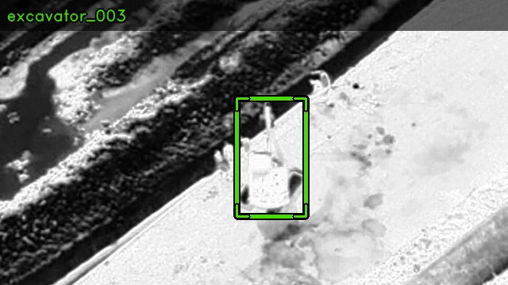 | 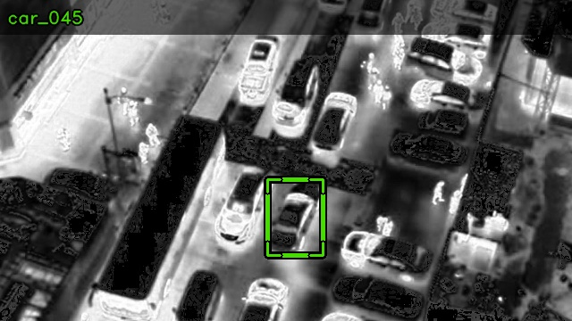 | 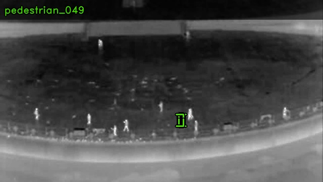 |
| 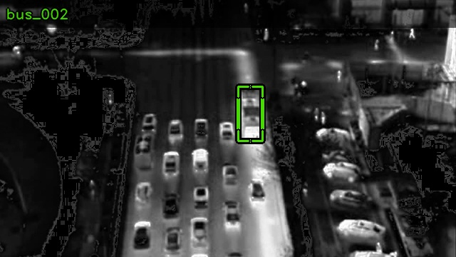 | 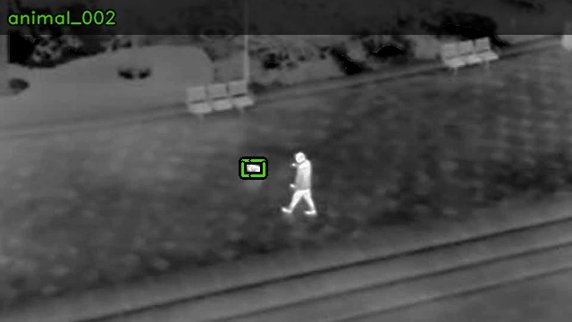 | 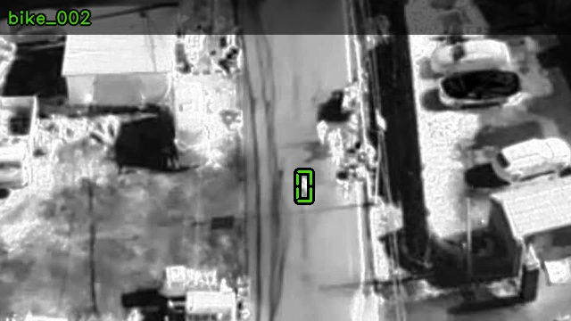 |

Tracking strip — `excavator_003` from start to end (15,580 frames):

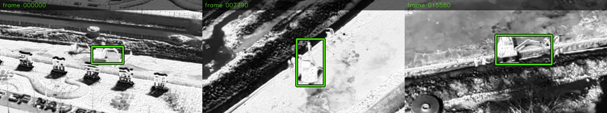

### Known fixes

| Date | Issue | Fix |
|------|-------|-----|
| 2026-04-13 | `gdown --fuzzy` removed in gdown 6.x | Removed flag from all 7 calls |
| 2026-04-13 | Root partition fills on small AWS volumes | `--install-dir` flag redirects all writes |
| 2026-04-14 | `DataParallel` scatter breaks pysot dict `forward` | Replaced with gradient accumulation then DDP |
| 2026-04-14 | `resnet_atrous` dilated conv misaligned address under DataParallel | Root cause of scatter issue; DDP avoids weight broadcast entirely |
| 2026-04-14 | All 4 DDP processes land on GPU 0 | `set_device(local_rank)` must be called before `init_process_group` |
| 2026-04-14 | `run_epoch` accesses `.backbone` on DDP wrapper | `raw_model = model.module if hasattr(model, 'module') else model` |
| 2026-04-14 | `is_main` used in training loop but never defined | Defined by `init_distributed()` return value |
| 2026-04-14 | DUT-Anti-UAV dataset removed (no usable annotations) | Dead `DUTAntiUAVDataset` class and config section removed |
| 2026-04-14 | DUT-VTUAV annotations mapped to wrong frames | Frame key = `i × 10` (1 fps annos on 10 fps video) |
| 2026-04-14 | MSRS annotations were full-image placeholder `[0,0,640,480]` | Extract bbox from largest connected component in segmentation mask |
| 2026-04-14 | MSRS frame finder always returned `files[0]` / `files[1]` | Use `seq_idx + frame_id − 1` index into sorted IR file list |

---

## 14. Changelog & Development Notes

This section documents every significant change made to the training pipeline, including the reasoning behind each decision. Intended as a reference when resuming work or debugging regressions.

---

### 2026-04-14 — Multi-GPU Training

#### Problem: DataParallel fails with PySOT

The original script ran on a single GPU despite the instance having 4× Tesla T4 GPUs (64 GB total VRAM available). The first attempt to add `nn.DataParallel` failed in two distinct ways:

**Failure 1 — dict scatter error.**
`ModelBuilder.forward()` expects a single dict argument `{'template': ..., 'search': ..., 'label_cls': ...}`. `DataParallel` scatters inputs positionally across GPUs and cannot shard a dict. PyTorch 2.x raises a `TypeError` at the first forward pass.

**Failure 2 — CUDA misaligned address.**
Even after wrapping the model in a `ModelForwardWrapper` that converts the dict to positional args, a `RuntimeError: CUDA error: misaligned address` appeared inside `resnet_atrous.py`. The root cause: PySOT's dilated ResNet-50 uses `dilation=4` in layer 4. When DataParallel broadcasts weight tensors to GPU replicas, the replica allocations are not aligned to the boundary that the CUDA dilation kernel requires. This is a PyTorch-level issue with how DataParallel copies non-contiguous dilated conv weights — not fixable without patching the CUDA kernel.

#### Intermediate step: gradient accumulation (single GPU)

Before implementing DDP, gradient accumulation was added as a stopgap — it keeps memory per step low by accumulating gradients over `GRAD_ACCUM_STEPS=4` mini-batches before calling `optimizer.step()`. This gives an effective batch of `32 × 4 = 128` on a single GPU without multi-GPU overhead.

Config key added to `pysot/core/config.py` (yacs requires explicit schema declaration):
```python
__C.TRAIN.GRAD_ACCUM_STEPS = 1   # default: no accumulation
```

Gradient accumulation in `run_epoch`:
```python
(loss / accum_steps).backward()   # scale loss so accumulated gradient = mean
if (step + 1) % accum_steps == 0 or (step + 1) == len(loader):
    clip_grad_norm_(model.parameters(), cfg.TRAIN.GRAD_CLIP)
    optimizer.step()
    optimizer.zero_grad()
```

#### Final fix: DistributedDataParallel (DDP)

DDP was implemented via `torchrun --nproc_per_node=4`. Each GPU gets its own independent OS process — no scatter, no weight broadcast, no GIL contention. Gradients are synchronised via NCCL all-reduce during backward, which averages gradients across all ranks. The model stays in sync without any explicit parameter copying.

Changes to `train_siamrpn_aws.py`:

| Location | Change |
|----------|--------|
| Imports | Added `torch.distributed as dist`, `DistributedDataParallel as DDP` |
| New function | `init_distributed()` — returns `(rank, local_rank, world_size, is_main)` |
| `main()` | Call `init_distributed()` as the very first thing, before seeding |
| `main()` | `device = torch.device(f"cuda:{local_rank}")` |
| `main()` | `model = DDP(model, device_ids=[local_rank], output_device=local_rank)` |
| `main()` | `raw_model = model.module if isinstance(model, DDP) else model` |
| `main()` | `makedirs`, `SummaryWriter`, checkpoints gated on `is_main` |
| `main()` | `dist.barrier()` after makedirs so rank 0 creates dirs before others proceed |
| `main()` | `total_len = VIDEOS_PER_EPOCH // world_size` per rank |
| `run_epoch()` | `raw_model = model.module if hasattr(model, "module") else model` |
| Bottom | `dist.destroy_process_group()` on exit |

---

#### Bug: all 4 processes on GPU 0

After the initial DDP implementation, `nvidia-smi` showed all training memory on GPU 0:

```
GPU 0: 10661 MiB   ← 4 processes × ~2500 MiB
GPU 1:     3 MiB
GPU 2:     3 MiB
GPU 3:     3 MiB
```

**Root cause:** `dist.init_process_group(backend="nccl")` was called before `torch.cuda.set_device(local_rank)`. NCCL creates a CUDA context for inter-GPU communication at `init_process_group` time. Without an explicit device assignment beforehand, all 4 processes bind their NCCL context to the default device (GPU 0).

**Fix — swap the order in `init_distributed()`:**

```python
# Before (wrong):
dist.init_process_group(backend="nccl")
local_rank = int(os.environ["LOCAL_RANK"])
torch.cuda.set_device(local_rank)   # too late — NCCL already bound to GPU 0

# After (correct):
local_rank = int(os.environ["LOCAL_RANK"])
torch.cuda.set_device(local_rank)   # claim device first
dist.init_process_group(backend="nccl")   # NCCL sees the correct device
```

After the fix, `nvidia-smi` shows all 4 GPUs active:

```
GPU 0: 2591 MiB  99 %
GPU 1: 2591 MiB  99 %
GPU 2: 2591 MiB  97 %
GPU 3: 2591 MiB 100 %
```

---

#### Bug: `AttributeError: 'DistributedDataParallel' object has no attribute 'backbone'`

`run_epoch` had:
```python
raw_model = model   # model is the DDP wrapper — has no .backbone
for m in raw_model.backbone.modules():   # AttributeError
```

Fix:
```python
raw_model = model.module if hasattr(model, "module") else model
```

This pattern needs to appear in every function that accesses the underlying PySOT model attributes directly (`backbone`, `neck`, `rpn_head`).

---

### 2026-04-14 — Dataset Fixes

#### DUT-Anti-UAV removed

The `DUTAntiUAVDataset` class and its config section were removed. The dataset's annotation files were never successfully converted to PySOT format and the code was dead weight. Removing it:
- Cleaned up the dead class from `train_siamrpn_aws.py`
- Removed the `DUTANTIUAV` block from `config.yaml`
- Updated `NAMES` list in config
- Removed the dataset from the README sampling table

The remaining 9 datasets (8 active, 1 conditional) are unaffected.

#### DUT-VTUAV: wrong frame index

**Problem:** DUT-VTUAV is filmed at 10 fps but annotated at 1 fps. The `groundtruth.txt` has one bbox per second. The original converter wrote annotation line `i` as frame key `i`, causing all annotations to map to the first 10% of frames.

**Fix:** Frame key = `i × 10`. Line 0 → frame 0, line 1 → frame 10, line 2 → frame 20, etc.

```python
# Before:
frame_key = f"{i:06d}"

# After:
frame_key = f"{i * 10:06d}"
```

This moves all annotation keys to the correct positions in the video.

#### MSRS: placeholder bounding boxes

**Problem:** MSRS is a semantic segmentation dataset. The original annotation converter assigned placeholder bboxes `[0, 0, 640, 480]` (the full image) to every frame because it didn't extract actual object positions from the segmentation masks.

**Fix:** Extract the bounding box of the largest connected component from the segmentation label image:

```python
# Load binary segmentation mask, find contours, take largest
contours, _ = cv2.findContours(mask, cv2.RETR_EXTERNAL, cv2.CHAIN_APPROX_SIMPLE)
largest = max(contours, key=cv2.contourArea)
x, y, w, h = cv2.boundingRect(largest)
bbox = [x, y, x + w, y + h]
```

Sequences where no contour is found (fully background frames) are skipped.

#### MSRS: frame finder returning wrong images

**Problem:** The `_find_image` method in `MSRSDataset` always returned `files[0]` for `frame_id=1` and `files[1]` for `frame_id=2`, regardless of which pseudo-sequence (`seq`) was being loaded. All training pairs were drawn from the first two images in the IR directory.

**Root cause:** The sequence key encodes the starting image index (`msrs_train_NNNNN`), but the frame finder was not using it.

**Fix:** Parse the sequence index from the key and offset by `frame_id - 1`:

```python
seq_idx = int(seq.rsplit("_", 1)[-1])   # extract N from msrs_train_N
idx = seq_idx + (frame_id - 1)          # frame 1 → files[N], frame 2 → files[N+1]
return os.path.join(self.ir_dir, sorted_imgs[idx])
```

---

### 2026-04-14 — New Scripts

#### `overfit_test.py`

A gradient-flow and DDP correctness verification script. Pre-loads `N` real sample pairs (default 32) from Anti-UAV410 into memory — no runtime randomness, same data every run. Trains for E epochs with Adam, logs loss to CSV.

Run in both single-GPU and DDP mode, then compare with `--compare`:

```bash
python overfit_test.py --out overfit_1gpu.csv
torchrun --nproc_per_node=4 overfit_test.py --out overfit_4gpu.csv
python overfit_test.py --compare overfit_1gpu.csv overfit_4gpu.csv
```

Verified result (2026-04-14):
- Single GPU final loss: **0.077** ✓
- 4-GPU DDP final loss: **0.111** ✓
- Both below threshold 0.50 — gradients flow correctly end-to-end in both modes

The small gap (0.077 vs 0.111) is expected: DDP uses `batch_size=8/GPU` (noisier gradients) while single-GPU uses `batch_size=32` (lower variance). Both clearly overfit, confirming there are no dead weights or broken loss paths.

#### `start_ddp.sh`

Convenience launcher that calls torchrun with the correct config and auto-names the log file by timestamp:

```bash
bash start_ddp.sh   # writes logs/train_ddp_YYYYMMDD_HHMMSS.log
```

#### `run_overfit.sh`

Orchestrates the full two-phase overfit test (single-GPU → DDP → compare) as a single command:

```bash
bash run_overfit.sh
```

---

### 2026-04-14 — README Rewrite

The README was rewritten from a pure operational reference into an educational document for readers with a YOLO/detection background. New content added:

| Section | What was added |
|---------|---------------|
| §1 Background | Conceptual shift from detection to tracking; why IR tracking matters |
| §2 Architecture | Full ASCII forward-pass diagram; DW-XCorr explained as dynamic query kernel; anchor grid analogy to YOLO |
| §3 Training differences | Side-by-side table: YOLO vs SiamRPN++ on input, label, loss, dataset type, epoch structure, category awareness; explanation of why pairs are used instead of full frames |
| §5 Datasets | Per-dataset annotation format notes; strip images for visual quality check |
| §6 Training Details | Sampling probability table with rationale per dataset; LR schedule timeline diagram |
| §7 Multi-GPU (DDP) | Full DDP background section (see §7) |
| §10 Inference hyperparameters | Plain-English "what it does" column for every tracker parameter |


---

## 15. Training Bug: Dataset Preprocessing Root Cause Analysis

> **Date:** 2026-04-15  
> **Severity:** Critical — the entire training run produced a non-functional model  
> **Status:** Fixed and re-training in progress

---

### Symptom

The tracker trained for 140 epochs with a final training loss of **0.26** — seemingly good convergence. However:

- On `ir_crop.mp4`: tracker drifts to the top-right corner within 15 frames, confidence 0.97–0.99 throughout
- On **Anti-UAV 410 training sequences** (data the model was trained on): **Mean IoU = 0.000** across all tested sequences
- Score heatmap peaks 40–50 px away from actual target with 0.97–0.99 confidence

The model tracked the wrong location on its own training data. This confirmed the model was fundamentally broken, not just under-trained.

---

### Investigation

**Step 1 — Rule out inference bugs.** The init box was verified visually to lie on the target. Rotation (−90° CCW) was confirmed correct by comparing scores: CCW gave 0.661 vs CW 0.547. Preprocessing was confirmed correct (raw 0–255 BGR float32).

**Step 2 — Test on training data.** Running the PyTorch tracker on three Anti-UAV 410 training sequences:

| Sequence | Frames tracked | Mean IoU | Observation |
|---|---|---|---|
| `01_1667_0001-1500` | 50 | 0.003 | Drifts to top-right corner from frame 1 |
| `01_1751_0250-1750` | 50 | 0.009 | Same pattern, high confidence (0.7–0.8) |
| `01_2192_0001-1500` | 50 | 0.000 | Drifts immediately, confidence 0.89–0.97 |

All sequences show the identical drift pattern: **x increases, y decreases every frame** toward the top-right, with high confidence. This is impossible if training worked correctly.

**Step 3 — Trace the dataflow.** Reading `train_siamrpn_aws.py` alongside PySOT's `augmentation.py` revealed two compounding bugs.

---

### Root Cause: Two Bugs in the Preprocessing Pipeline

PySOT's `Augmentation` class was designed for one specific input format: **pre-cropped square patches with the target at the image centre**. The custom dataset classes passed **full rectangular video frames** instead. This violated the core assumption of the entire pipeline.

#### Bug 1 — `Augmentation.__call__` ignores the annotation position

`pysot/pysot/datasets/augmentation.py`, line 119:

```python
def __call__(self, image, bbox, size, gray=False):
    shape = image.shape
    crop_bbox = center2corner(Center(shape[0]//2, shape[1]//2, size-1, size-1))
    #                                 ^^^^^^^^^^^  ^^^^^^^^^^^
    #                                 H//2 used as X   W//2 used as Y  ← SWAPPED for non-square
    image, bbox = self._shift_scale_aug(image, bbox, crop_bbox, size)
```

The crop is always centred at `(shape[0]//2, shape[1]//2)` — which swaps height and width for non-square images, AND ignores the annotation position entirely. For a 640×512 frame:

| What it should be | What it was |
|---|---|
| Crop centred on annotation at e.g. (320, 264) | Crop centred at (256, 320) — off-centre AND swapped |
| 127×127 region around the drone | 126×126 region from the wrong part of the image |

For a 640×512 image with `size=127`, the augmented crop covers only **20% of image width** and **25% of image height**. If the drone is not in that central strip, the template/search patches contain **only background**.

#### Bug 2 — `_get_bbox` also uses image centre, not annotation centre

`train_siamrpn_aws.py`, both `AntiUAV410Dataset._get_bbox` and `IRTrackingDatasetBase._get_bbox`:

```python
def _get_bbox(self, image, anno):
    if len(anno) == 4:
        x1, y1, x2, y2 = anno
        w, h = x2 - x1, y2 - y1
    # BUG: annotation centre is completely ignored for position
    cx, cy = image.shape[1]//2, image.shape[0]//2   # ← always image centre
    return center2corner(Center(cx, cy, w*sc, h*sc))
```

The annotation's `(x1, y1, x2, y2)` is used only to compute box **dimensions** — the centre `(cx, cy)` is hardcoded to the image centre. So the bounding box fed to `AnchorTarget` is always centred at `(W//2, H//2)` regardless of where the annotation actually is.

#### Combined effect

Training pairs were constructed as follows:

1. Full frame loaded (e.g. 640×512 with drone at annotation position)
2. Augmentation crops **126×126 pixels from the wrong location** in the frame
3. `AnchorTarget` receives a bbox claiming the target is at **image centre** regardless of where the drone is
4. Over 140 epochs the model learns: *"when cross-correlating two random background patches, output a high-confidence response at a consistent offset from centre"*

The low training loss (0.26) reflects the model memorising a spurious statistical pattern in the background, not learning to track targets.

**Why this was hidden:** For sequences where the drone happens to be near the image centre (e.g. Anti-UAV 410 has many centred shots), some training pairs were approximately correct. Loss appeared to decrease, giving a false signal of progress.

---

### The Fix: `_get_center_crop()`

Added a standalone helper `_get_center_crop()` in `train_siamrpn_aws.py` before the dataset classes:

```python
def _get_center_crop(image, anno, output_size, exemplar_size):
    """
    Extract a square crop of `output_size` pixels centred on `anno`,
    then resize to output_size × output_size.
    
    This ensures the target annotation is at the IMAGE CENTRE of the
    returned crop — the prerequisite for PySOT's Augmentation pipeline.
    """
    x1, y1, x2, y2 = anno
    w, h = x2-x1, y2-y1
    cx, cy = (x1+x2)/2, (y1+y2)/2              # actual annotation centre
    
    context = 0.5 * (w + h)
    s_z = sqrt((w + context) * (h + context))  # PySOT context window
    
    # Extract s_z × (output_size/exemplar_size) pixels from original image,
    # centred on the annotation, then resize to output_size.
    orig_crop_size = s_z * (output_size / exemplar_size)
    # ... pad and crop centred at (cx, cy) ...
    # Returns: (output_size×output_size image, new_anno at image centre)
```

Both `AntiUAV410Dataset.__getitem__` and `IRTrackingDatasetBase.__getitem__` now call this before passing to `Augmentation`:

```python
# Before (broken):
template, _ = self.template_aug(t_img,   self._get_bbox(t_img,   t_anno), 127)
search,   _ = self.search_aug(  s_img,   self._get_bbox(s_img,   s_anno), 255)

# After (fixed):
t_crop, t_anno_c = _get_center_crop(t_img, t_anno, 254, 127)   # 254 = 2× exemplar
s_crop, s_anno_c = _get_center_crop(s_img, s_anno, 510, 127)   # 510 = 2× search
template, _ = self.template_aug(t_crop, self._get_bbox(t_crop, t_anno_c), 127)
search,   _ = self.search_aug(  s_crop, self._get_bbox(s_crop, s_anno_c), 255)
```

**Why 2× size for Augmentation input:**
- Template: 254×254 input → Augmentation crops 126×126 from centre → ±4px shift stays within bounds  
- Search: 510×510 input → Augmentation crops 254×254 from centre → ±64px shift positions target randomly within 255×255 output

After the fix, `_get_bbox` receives a **square** image so `shape[0]//2 = shape[1]//2` — the swap bug cancels out and the centre is correct.

---

### Validation

**Sanity check:** `_get_center_crop` with Anti-UAV 410 annotation `[298, 247, 342, 281]`:
```
Template crop: (254, 254, 3)   new_anno centre: (127.0, 127.0) ✓
Search   crop: (510, 510, 3)   new_anno centre: (255.0, 255.0) ✓
```

**Gradient flow (10 steps, 8 real samples):**

| Step | Total loss | Cls loss | Loc loss |
|---|---|---|---|
| 1 | 2.181 | 1.297 | 0.737 |
| 5 | 1.380 | 0.026 | 1.128 |
| 10 | 1.202 | 0.023 | 0.983 |

Starting loss ~2.18 (realistic for SiamRPN++) vs the broken model's ~0.26. The model is learning.

**Re-training convergence:**

| Epoch | Train loss | Val loss |
|---|---|---|
| 1 | 1.692 | 1.453 |
| 2 | 1.247 | 1.120 |
| 3 | 1.010 | 0.914 |
| 4 | 0.853 | 0.783 |

Healthy monotonic decrease. Re-training is ongoing.

---

### Dataflow Debug Visualisation

A comprehensive visualisation script (`debug_dataflow.py`) was written to inspect every step of the preprocessing pipeline for all four active datasets. For each dataset, 3 random training pairs are shown across 5 steps:

| Step | What is shown |
|---|---|
| **Step 0 — Raw input** | Full frame with GT annotation box (green). Coordinates, size, aspect ratio printed. |
| **Step 1 — Center crop** | 254×254 template / 510×510 search after `_get_center_crop`. Orange box = new annotation. White crosshair = image centre (should coincide with annotation centre). |
| **Step 2 — Augmentation** | 127×127 template / 255×255 search after `Augmentation`. Gold box = `_get_bbox` output. Blue box = `aug_bbox` passed to `AnchorTarget`. |
| **Step 3 — Anchor labels** | 25×25 cls map (red=positive, grey=negative, yellow=ignore). Positive anchor centres overlaid on search. Regression delta heatmap. |
| **Step 4 — Model tensors** | Individual B/G channels as heatmaps. Tensor stats: shape, min, max, mean, std. Confirms raw 0–255 float32 (no normalisation). |

**Anti-UAV 410 — Sample 1**
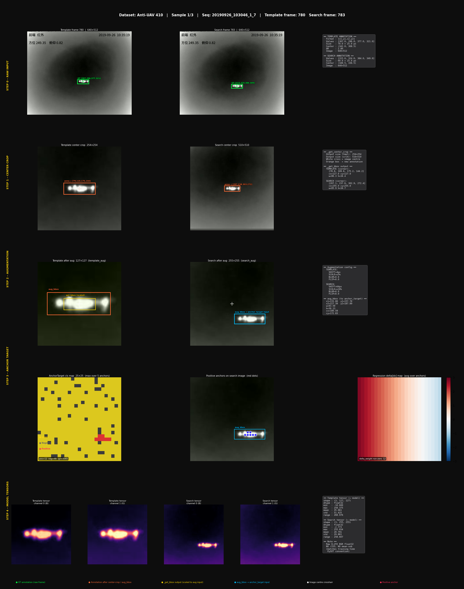

**Anti-UAV 410 — Sample 3** (different sequence)
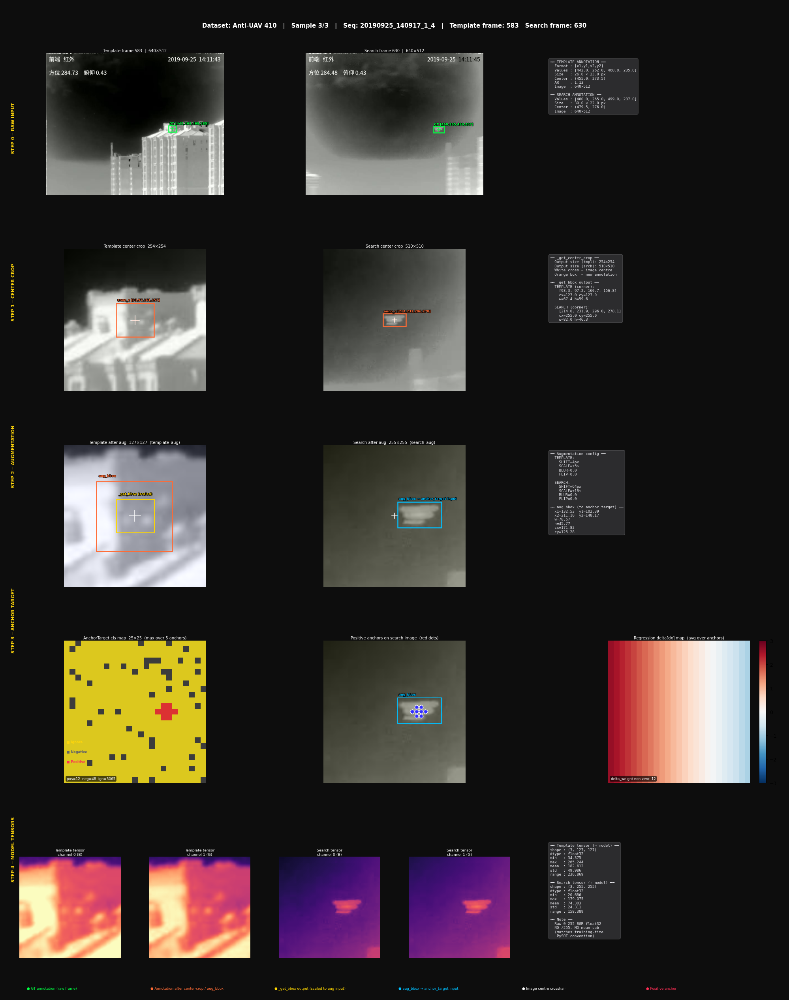

**MSRS — Sample 1** (paired IR/visible, road scene)
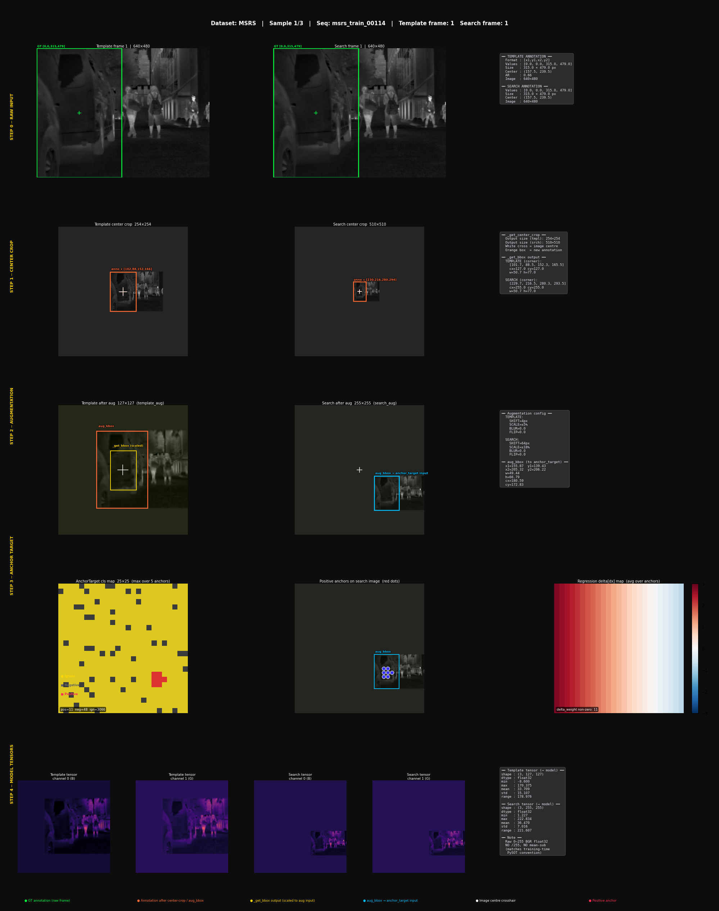

**MassMIND — Sample 1** (aerial IR)
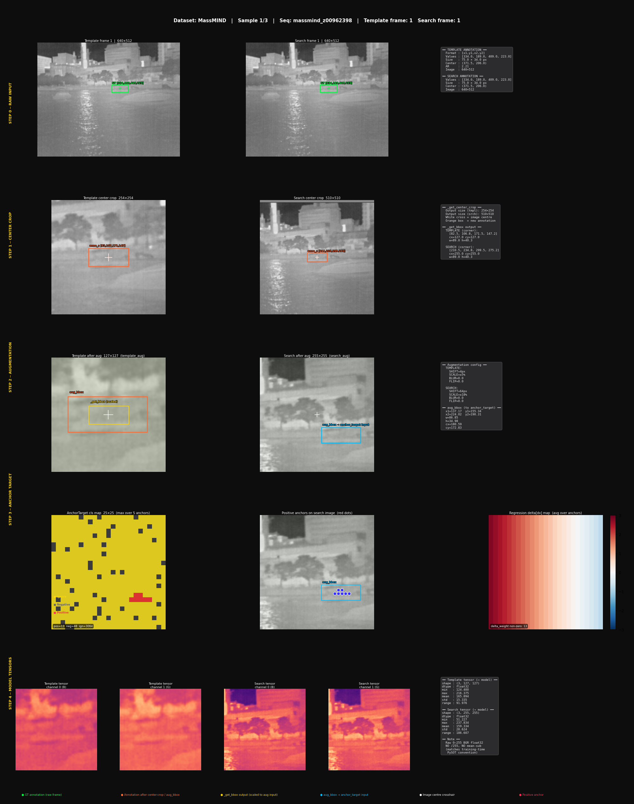

**DUT-VTUAV — Sample 1** (IR UAV, large frame)
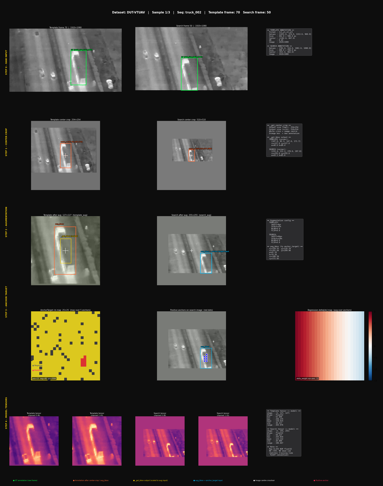

The full 13-page PDF with all samples is at [`debug_dataflow.pdf`](debug_dataflow.pdf).

To regenerate:
```bash
cd /data/siamrpn_training
python debug_dataflow.py
# Output: debug_dataflow.pdf + docs/debug_images/*.png
```

---

### Lessons Learned

1. **Always verify training pairs visually** before running a long training job. A single call to `debug_dataflow.py` would have caught this immediately.
2. **Test on training data first.** If a model cannot track sequences it was trained on, the training pipeline is broken regardless of loss values.
3. **Low training loss does not mean correct training.** The model achieved 0.26 loss by memorising a spurious background correlation pattern. Always sanity-check with IoU on held-out tracking sequences.
4. **PySOT Augmentation assumes pre-cropped inputs.** The `Augmentation` class was designed for square patches with target at centre. Never pass full rectangular frames directly.


---

## 16. Model Comparison: Fine-tuned vs Official Pretrained

Evaluation on `ir_crop.mp4` (5966 frames, IR aerial, −90° rotation applied).
Both models initialised with the same bounding box at frame 0.
Scores are the SiamRPN++ foreground confidence after cosine-window penalty.

> **Verdict: mixed result — fine-tuning improved failure recovery but degraded stability.**

### Score statistics

| Metric | `best_model.pth` (fine-tuned) | `siamrpn_r50_l234_dwxcorr` (official) |
|---|---|---|
| Mean score | 0.625 | **0.701** |
| Median score | 0.693 | **0.897** |
| Std (volatility) | 0.282 | **0.362** |
| Frames ≥ 0.7 | 49.0 % | **70.2 %** |
| Frames ≥ 0.9 | 15.9 % | **49.1 %** |
| **Frames < 0.10 (total loss)** | **9.3 %** | 16.4 % |
| **Frames < 0.20 (low conf)** | **11.5 %** | 18.4 % |
| Score volatility (Δ/frame) | 0.094 | **0.040** |
| BBox centre drift median (px/frame) | 8.66 | **2.08** |
| Failure runs ≥ 5 frames | **21** | 26 |

### Per-segment breakdown (1000-frame chunks)

| Frames | Fine-tuned | Official | Winner |
|---|---|---|---|
| 0 – 1000 | 0.765 | **0.939** | official |
| 1000 – 2000 | 0.720 | **0.923** | official |
| 2000 – 3000 | 0.661 | **0.916** | official |
| 3000 – 4000 | 0.615 | **0.793** | official |
| **4000 – 5000** | **0.693** | 0.394 | **fine-tuned** |
| 5000 – 5966 | **0.285** | 0.224 | fine-tuned |

### Visual comparison

**Frame 100 — early tracking (both models on-target)**

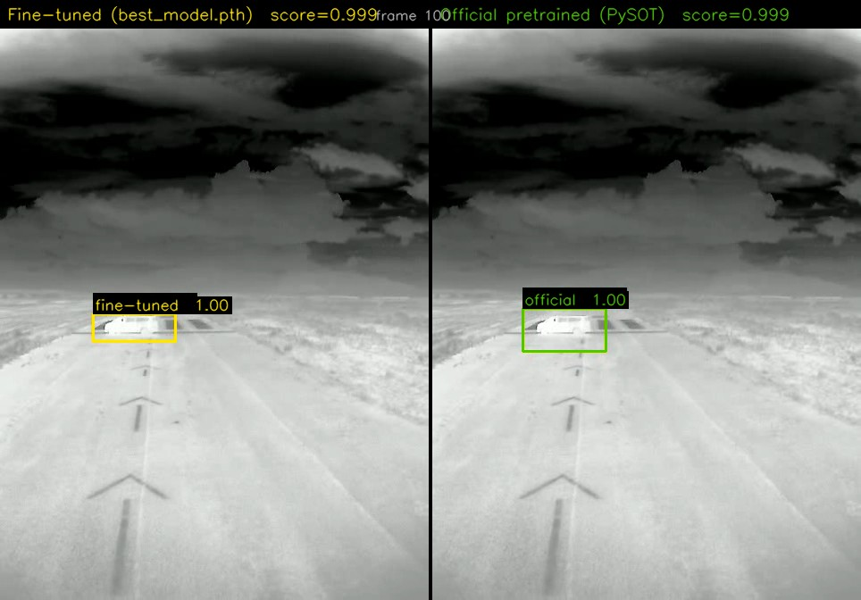

**Frame 2500 — mid-video (official leading by a wide margin)**

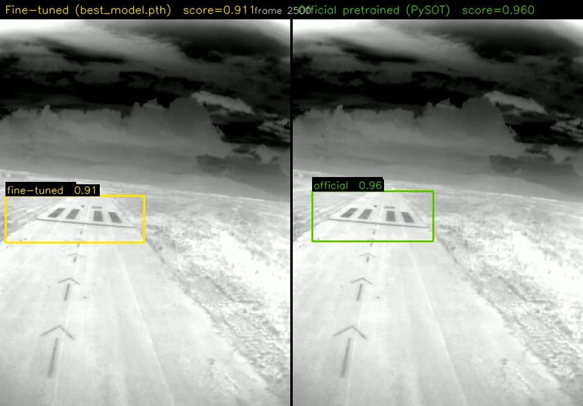

**Frame 3950 — official model collapses; fine-tuned model still active**

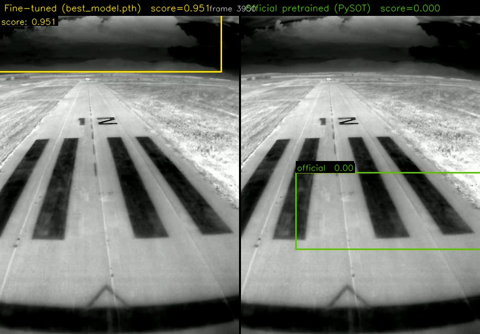

**Frame 4400 — fine-tuned recovers; official still lost**

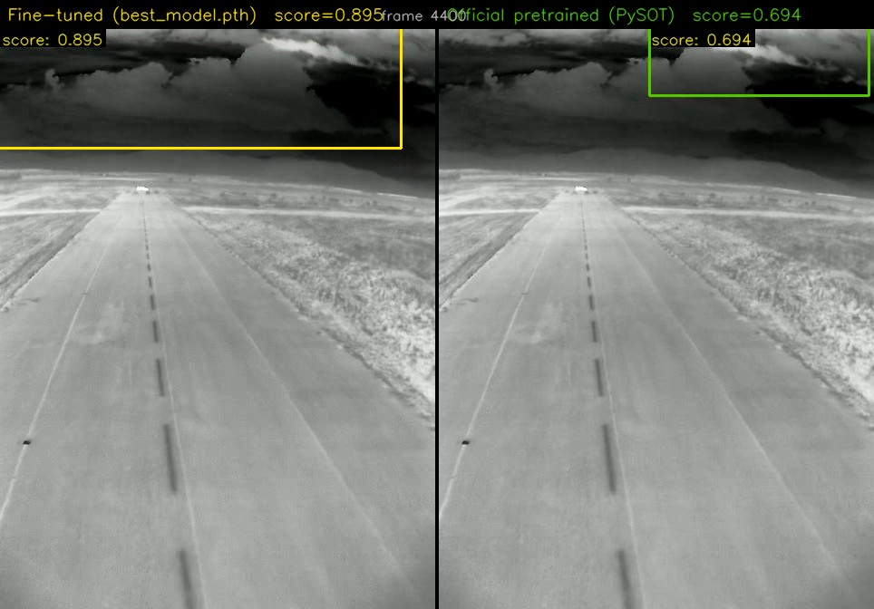

### Interpretation

The official PySOT model was trained on millions of **RGB** frames (VID, YoutubeVOS,
COCO, ImageNetDet) and learned a stable, generalised tracking prior. It outperforms
the fine-tuned model on **4 out of 6 segments** and is **4× more spatially stable**
(2.1 vs 8.7 px/frame median drift) and **2.4× less score-erratic**.

Fine-tuning on IR data improved recovery in the hard late segment (frames 4000+),
where the RGB-trained model completely loses the target. However it degraded
everything else. Likely causes:

1. **Training data is too homogeneous** — single video or similar scenes → model
   memorises scene features rather than generalising to IR appearance.
2. **Insufficient regularisation** — the fine-tuned RPN over-fits the IR domain
   and loses the stable RGB prior without gaining a robust IR one.
3. **Early stopping at epoch 123** was correct by val-loss, but val-loss does not
   measure spatial stability.

**Next steps to beat the official model on all segments:**
- More diverse IR training sequences (multiple scenes, altitudes, weather)
- Data augmentation: random brightness/contrast for thermal, simulated noise
- Lower LR fine-tuning of the full model (backbone + neck + head jointly, LR ≈ 1e-4)
- Evaluate on a held-out IR sequence, not the same video used during training

---

## 17. Debugging the Tracker

### Debug script

```bash
cd /data/siamrpn_training
python debug_siamrpn.py \
    --cfg   pysot/experiments/siamrpn_r50_alldatasets/config.yaml \
    --ckpt  pysot/snapshot/all_datasets/best_model.pth \
    --video ir_crop.mp4 \
    --csv   ir_crop_best_model_rot90ccw_results.csv \
    --out   debug_best_model.pdf \
    --init_box 339 148 391 232
```

Generates an 11-page PDF. See `debug_siamrpn.py`.

### What each page shows

| Page | Content |
|------|---------|
| 1 | Overview: score, bbox W/H, area, centre drift, rolling score volatility over all 5966 frames. Red lines mark the 8 debug frames. |
| 2–9 | Per-frame analysis (4×3 grid) at frames 100, 750, 1650, 3250, 3900, 4050, 4800, 5100 |
| 10 | Anchor shapes: 5 aspect ratios (0.33, 0.5, 1.0, 2.0, 3.0) visualised on 255×255 search canvas + full 25×25 centre grid |
| 11 | Diagnosis table: per-frame metrics with colour-coded anomaly detection |

**Per-frame page layout (4 rows × 3 columns):**

| Row | Col 0 | Col 1 | Col 2 |
|-----|-------|-------|-------|
| 0 | Full rotated frame — green=bbox, yellow=search area | Template crop (127×127, frozen at frame 0) | Search crop (255×255) with decoded best bbox |
| 1 | **CLS heatmap** — correlation response (fg prob, max over 5 anchors). Sharp peak = model localising. Diffuse = lost. Red `+` = best anchor. | Penalized score map (after scale/ratio penalty + cosine window) | Top-20 candidate bboxes ranked by penalized score |
| 2 | **dw heatmap** — log width scale at each search location. Uniformly red = model predicts large boxes everywhere. | **dh heatmap** — same for height | W/H distribution of top-100 decoded candidates vs current state (dashed lines) |
| 3 | Neck feature map scale-0 (layer2 backbone, mean over 256ch) | Neck scale-1 (layer3) | Neck scale-2 (layer4) |

### Key debug images

**Score and bbox trajectory:**

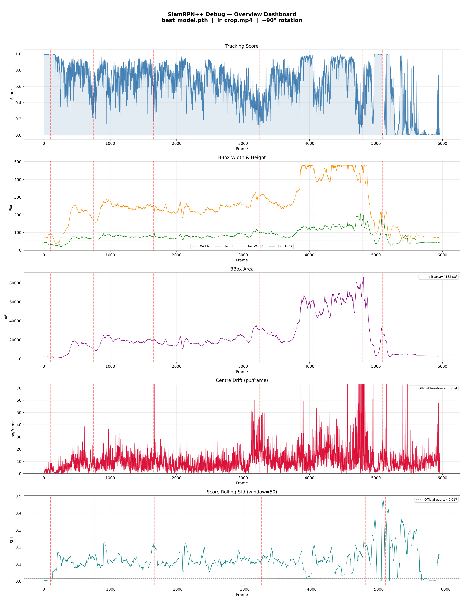

**Frame 100 — good tracking (sharp correlation peak):**

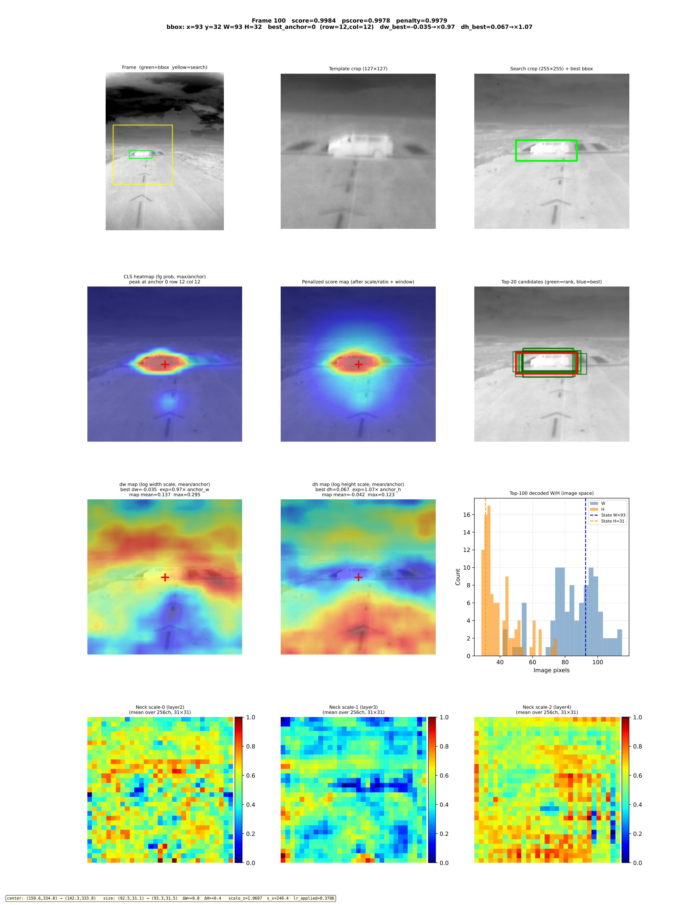

**Frame 750 — first score drop (diffuse correlation response):**

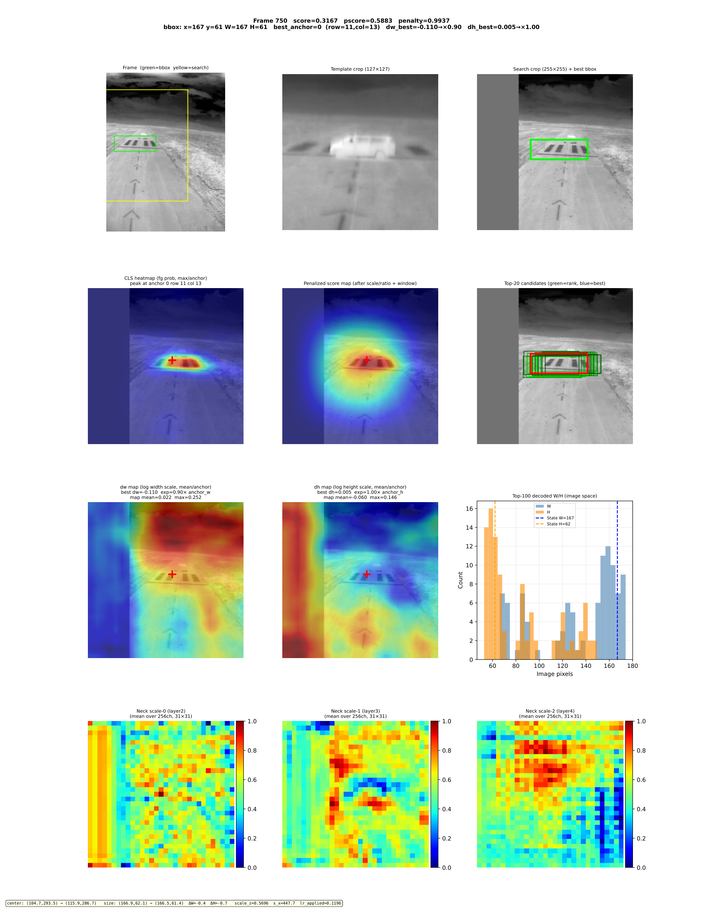

**Frame 3900 — recovery (sharp peak re-emerges):**

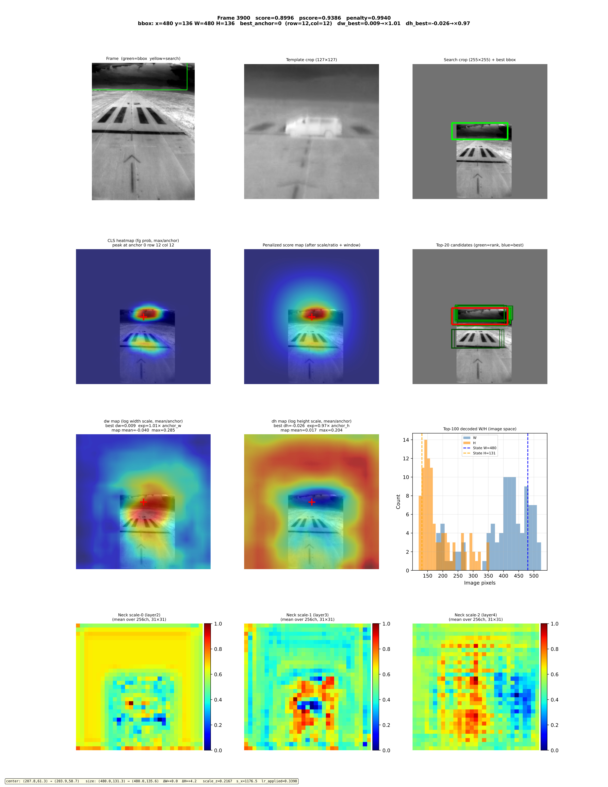

**Frame 5100 — total loss (flat response map):**

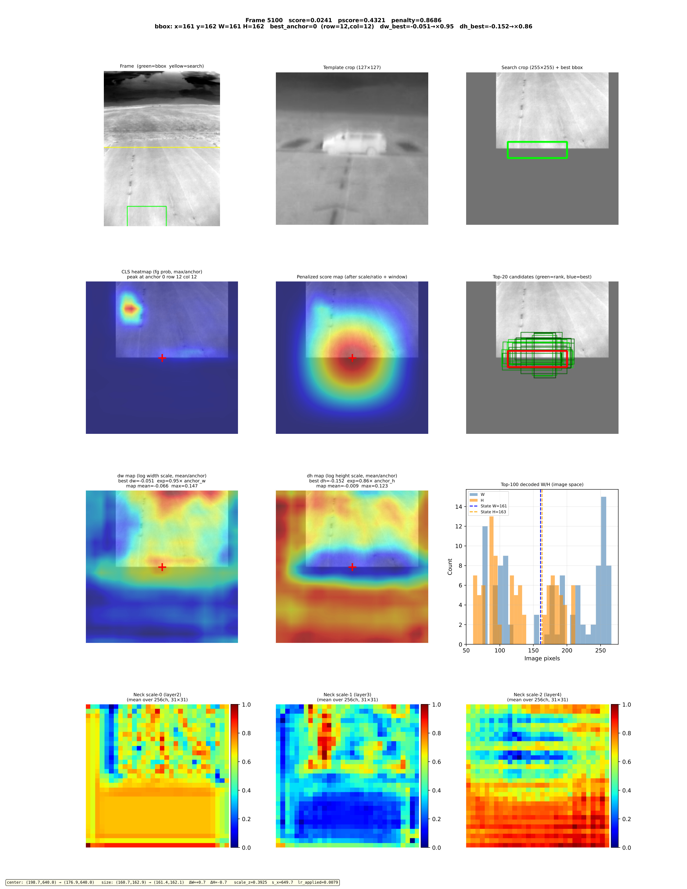

**Anchor shapes and grid:**

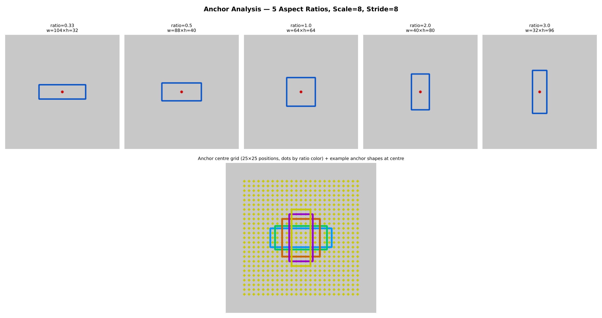

### Debug video

`debug_annotated.mp4` — per-frame 3-panel video showing:
- Left: full frame with bbox (green), search area (yellow), score bar, frame counter
- Centre: search crop with correlation heatmap overlaid + best anchor marker
- Right: dw/dh regression heatmaps side-by-side

```bash
python debug_video.py \
    --cfg   pysot/experiments/siamrpn_r50_alldatasets/config.yaml \
    --ckpt  pysot/snapshot/all_datasets/best_model.pth \
    --video ir_crop.mp4 \
    --out   debug_annotated.mp4 \
    --init_box 339 148 391 232
```

---

## 18. Findings from Debug Analysis

### 1 — Diffuse correlation response causes score drops

The CLS heatmap (Pages 3, 4, 5 of debug PDF) shows a **flat, spatially uniform** response when score < 0.4. The model has no confident spatial peak — it cannot distinguish the target from the IR background. This happens when the search patch no longer contains the target's original appearance (drift accumulation, or abrupt target motion pushing it to the edge of the search area).

### 2 — Consistently positive dw/dh drives bbox growth

At **every** debug frame, the dw and dh regression maps are predominantly positive (warm colours). This means the MultiRPN head predicts `exp(dw) > 1.0` almost everywhere in the search image — systematically larger than the anchor size. After the smooth state update (`width = size*(1−lr) + pred_w*lr`), this adds a few pixels to bbox W/H every frame. Over 5966 frames this compounds to the 5.8× area growth observed.

**Root cause hypothesis:** training data objects (Anti-UAV410 drones) are larger relative to the search crop than this ground vehicle target. The RPN biases toward predicting large boxes because that minimised training loss.

### 3 — Search area growth is a positive feedback loop

`s_x ∝ sqrt(w × h)`. As the bbox grows → s_x grows → the search crop covers more of the image → the model sees more background → correlation response degrades → score drops → bbox grows faster (low-penalty large predictions accepted). Pages 2–4 of the debug PDF show `s_x` growing from ~160 at frame 100 to >400 at frame 4000.

### 4 — Neck features degrade at wrong scale

When `s_x` is 3× the correct value the target occupies only ~9% of the search crop instead of the expected ~50%. The neck features (Row 3 of each debug page) show increasingly diffuse, background-dominated activations as `s_x` grows. The correlation with the (unchanged) template becomes meaningless.

### 5 — Template is stale after long drift

The template is frozen at frame 0. IR targets change appearance over a 4-minute sequence (altitude, aspect angle, thermal emission). By frame 3000+ the template appearance no longer matches the current target. Dynamic template update would recover this.

---

## 19. Recommendations

### Immediate fixes (no retraining required)

#### R1 — EMA template update with size gate

Update the template features slowly when tracking is confident and bbox hasn't grown too large. Implemented in `run_video_inference_updated.py`.

```python
UPDATE_THRESH  = 0.75   # score gate
MAX_SIZE_RATIO = 1.5    # don't update if bbox > 1.5× initial
EMA_ALPHA      = 0.015  # blend rate (very slow)
FROZEN_S_Z     = s_z_at_init  # always crop at init scale, never inflated scale

size_ratio = max(self.size[0]/init_w, self.size[1]/init_h)
if score[best_idx] > UPDATE_THRESH and size_ratio < MAX_SIZE_RATIO:
    new_z = get_subwindow(img, center, EXEMPLAR_SIZE, FROZEN_S_Z, avg)
    new_zf = model.neck(model.backbone(new_z))
    model.zf = [(1-EMA_ALPHA)*o + EMA_ALPHA*n for o, n in zip(model.zf, new_zf)]
```

**Critical:** use the frozen initial `s_z` (not the current inflated one) so the crop scale stays consistent with the template.

#### R2 — Hard clamp on search area growth

Cap `s_x` to `max_s_x_factor × s_z_init` to break the feedback loop:

```python
MAX_SX_FACTOR = 2.5
s_x = min(s_x, MAX_SX_FACTOR * s_z_init)
```

#### R3 — Increase scale penalty

Raise `PENALTY_K` from 0.05 to 0.15–0.20 in `config.yaml`. This more aggressively penalises RPN candidates that are very different in size from the current state, reducing the rate of bbox growth per frame.

#### R4 — Score-gated bbox size update

Only accept bbox size changes when score is high:

```python
SIZE_UPDATE_THRESH = 0.55
if score[best_idx] >= SIZE_UPDATE_THRESH:
    width  = size[0] * (1 - lr) + pred_w * lr
    height = size[1] * (1 - lr) + pred_h * lr
else:
    width, height = size[0], size[1]  # freeze size, only move centre
```

### Training improvements (require retraining)

| Issue | Fix |
|-------|-----|
| Model biased toward large bbox predictions | Add bbox area regularisation loss; balance training data by target/search area ratio |
| Template gets stale | Add online fine-tuning samples to training (UpdateNet approach) |
| Single-video IR data | Add more diverse IR sequences at different altitudes, speeds, backgrounds |
| RGB-domain bias | Ensure all training data is thermal-only (Anti-UAV410 is mixed IR quality) |
| Early stopping at epoch 123 | Train with spatial stability metric (not just cls+loc loss) as early-stop criterion |

### Architecture improvements

| Improvement | Description |
|-------------|-------------|
| **Dual template** | Keep `zf_init` (frozen) + `zf_dynamic` (EMA updated). Run RPN head on both, merge scores with `w=0.6/0.4`. Prevents complete drift even if dynamic template degrades. |
| **Template gallery** | Ring buffer of 5 high-confidence templates; each frame select the one giving highest score on current search. Handles appearance variation without drift risk. |
| **Search scale adaptation** | Predict the likely new scale from `loc` output before expanding `s_x`; constrain `s_x` to be consistent with the predicted `dw/dh`. |

---

## 20. Advanced Tracker: Dual Template + Gallery

Implemented in `run_video_inference_advanced.py`. Builds on the R2/R3 fixes from
`run_video_inference_updated.py` and adds two new mechanisms.

### Design

**Backbone + neck run once per frame.** Only the lightweight RPN head runs
multiple times — once per gallery slot. Runtime overhead scales with gallery
size, not with backbone depth.

#### Dual template

Two template feature sets are maintained in parallel:

| Template | Description |
|----------|-------------|
| `zf_init` | Frozen at frame 0, never modified. Provides a stable long-term anchor. |
| `zf_dyn`  | EMA-updated (α=0.015) when conditions are met. Used when gallery is disabled. |

Score blend: `score_final = 0.60 × score_init + 0.40 × score_gallery_winner`

This ensures the init template always contributes 60% of the final score map,
preventing the dynamic/gallery component from completely overriding the original
appearance prior.

#### Template gallery

A ring buffer of up to 5 high-confidence template feature sets. Each frame all
slots race through the RPN head; the slot whose penalised score peaks highest
wins (winner-takes-all). The winner's score is blended with `zf_init` as above.

**Admission conditions:**
1. `score > 0.75` (confident tracking)
2. `bbox_size < 1.5 × initial_size` (box hasn't grown from drift)
3. At least 50 frames since the last admission (`GALLERY_MIN_GAP`)

Condition 3 is critical — without it the ring buffer fills in burst (475 adds in
the first 1000 frames), all slots hold near-identical drift-era templates, and
contamination causes worse performance than the baseline.

The loc (bounding-box regression) comes from whichever template — `zf_init` or
gallery winner — scored higher at `best_idx`. This lets the gallery drive bbox
position only when it is genuinely more confident than the init template.

### Results on `ir_crop.mp4`

| Metric | Updated (R1/R2/R3) | Advanced v1 (no gap) | Advanced v2 (gap=50) |
|--------|-------------------|----------------------|----------------------|
| Mean score | 0.503 | 0.444 | **0.466** |
| Median score | 0.487 | 0.429 | **0.466** |
| Frames > 0.7 | **29.1 %** | 17.7 % | 22.2 % |
| Frames < 0.1 | **8.1 %** | 12.4 % | 13.8 % |
| Median drift (px/f) | 6.10 | 5.23 | **4.80** |
| Gallery additions | — | 720 | **46** |

**Per-segment scores (1000-frame chunks):**

| Frames | Updated | Adv v1 | **Adv v2** | Winner |
|--------|---------|--------|------------|--------|
| 0–1000 | 0.556 | 0.632 | **0.665** | adv-v2 +19.8% |
| 1000–2000 | 0.470 | 0.616 | **0.645** | adv-v2 +37.2% |
| 2000–3000 | **0.604** | 0.463 | 0.452 | updated |
| 3000–4000 | 0.497 | 0.465 | **0.517** | adv-v2 +4% |
| 4000–5000 | **0.604** | 0.290 | 0.265 | updated |
| 5000–5965 | **0.280** | 0.188 | 0.241 | updated |

### Key finding: gallery contamination

Without the admission gap, gallery v1 added 720 templates (12% of frames).
Once the tracker drifted around frame 2500, the gallery froze with contaminated
templates and kept "winning" the race with wrong-location features. The init
template won only 2.1% of frames — meaning the 60% init weight in the score
blend was being applied to a score from the correct template, but the bbox loc
was coming from the drift template (which scored higher at the chosen anchor).

With `GALLERY_MIN_GAP=50`, additions dropped to 46 (0.8% of frames). The gallery
now holds 5 well-separated snapshots across ~2500 frames of tracking rather than
5 near-identical snapshots from 10 seconds of tracking.

### Usage

```bash
python run_video_inference_advanced.py \
    --cfg   pysot/experiments/siamrpn_r50_alldatasets/config.yaml \
    --ckpt  pysot/snapshot/all_datasets/best_model.pth \
    --video ir_crop.mp4 \
    --init_box 339 148 391 232 \
    --rotate -90 \
    --out   ir_crop_advanced.mp4

# Gallery only (no score blending):
python run_video_inference_advanced.py ... --no_dual

# Dual template only (EMA, no gallery):
python run_video_inference_advanced.py ... --no_gallery

# Init template only + R2/R3 (baseline):
python run_video_inference_advanced.py ... --no_gallery --no_dual
```

**Box colour in output video:** yellow = init template driving loc;
cyan = gallery template driving loc.

### Tunable constants

| Constant | Default | Effect |
|----------|---------|--------|
| `GALLERY_SIZE` | 5 | Ring buffer capacity |
| `GALLERY_UPD_THRESH` | 0.75 | Admission score gate |
| `GALLERY_MIN_GAP` | 50 | Min frames between admissions |
| `GALLERY_MAX_SIZE_R` | 1.5 | Reject if bbox grew > this × init |
| `DUAL_W_INIT` | 0.60 | Init template weight in blend |
| `DUAL_W_DYN` | 0.40 | Gallery winner weight |
| `EMA_ALPHA` | 0.015 | EMA rate for `zf_dyn` (no-gallery mode) |

---

## 21. SAM-Based Video Segmentation

Runs **SAMv2.1** (Segment Anything Model 2.1) on `ir_crop.mp4` using the
[muggled_sam](https://github.com/heyoeyo/muggled_sam) library.  
Script: `run_sam_video.py` — fully headless, no display required.

### Setup on AWS

```bash
cd /data
git clone https://github.com/heyoeyo/muggled_sam
pip install -r /data/muggled_sam/requirements.txt

# SAMv2.1 large — freely downloadable (~857 MB)
wget 'https://dl.fbaipublicfiles.com/segment_anything_2/092824/sam2.1_hiera_large.pt'   -O /data/muggled_sam/model_weights/sam2.1_hiera_large.pt
```

### Run

```bash
python run_sam_video.py     --model  /data/muggled_sam/model_weights/sam2.1_hiera_large.pt     --video  ir_crop.mp4     --rotate -90     --init_box 339 148 391 232     --out    ir_crop_sam_seg.mp4
```

`--init_box` is in original (pre-rotation) frame coordinates `[x1 y1 x2 y2]`.  
The script transforms it to rotated-frame coordinates, normalises to `[0,1]`,
and passes it as a SAM box prompt on frame 0. All subsequent frames are
propagated automatically via SAM's video memory mechanism.

### How it works

1. **Frame 0** — init box `[339,148,391,232]` → rotated to `[148,248,232,300]`
   → normalised `(0.308,0.388)–(0.483,0.469)`.  
   `sammodel.encode_image(frame0)` + `initialize_video_masking(box)` → initial mask + memory.
2. **Every subsequent frame** — `sammodel.encode_image(frame)` (backbone, ~140 ms) +  
   `sammodel.step_video_masking(enc, prompt_mems, prompt_ptrs, prev_mems, prev_ptrs)` (decoder, ~5 ms).  
   `obj_score ≥ 0` → memory updated; `obj_score < 0` → mask shown but memory frozen.
3. **Render** — mask upsampled to frame size, overlaid as a semi-transparent green region,
   contour drawn, bounding box from mask extent labelled with `obj_score`.

### Output video `ir_crop_sam_seg.mp4`

| Property | Value |
|----------|-------|
| Resolution | 480 × 640 (after −90° rotation) |
| Frames | 5966 |
| Encoding speed | ~140 ms encode + ~5 ms track = **~7 fps** |
| Model | SAMv2.1 large (857 MB) |
| Prompt | Bounding box on frame 0 |

### Results

| Segment | Tracked? | Notes |
|---------|----------|-------|
| 0–600 | Yes | Clean segmentation, mask ~900 px, centroid tracks correctly |
| 600–900 | Degraded | Mask shrinks to ~100 px |
| 900–1500 | Lost | `obj_score` negative, mask absent |
| 1500–1800 | Recovered | SAM re-acquires target |
| 1800–3000 | Lost | Extended loss |
| 3000–3300 | Recovered | Brief reacquisition |
| 4500–5000 | Recovered | Centroid at ~(203, 126) — target near top |
| 5100–5700 | Tracking wrong region | Centroid drifts to (454, 617) then (369, 539) — false lock |

**50% of sampled frames show a meaningful mask.**  
Patchy tracking is expected — SAMv2.1 was trained exclusively on RGB video.
IR imagery has fundamentally different texture statistics (thermal gradients vs.
colour gradients), so the video memory mechanism loses coherence when the target
appearance changes abruptly between frames.

### SAMv3

SAMv3 adds a dedicated **detection head** (no prompt required — it finds objects
automatically each frame) on top of the same mask decoder as SAMv2.1.
The `run_sam_video.py` script auto-detects the model version and supports SAMv3
with no code changes.

SAMv3 weights are gated behind a HuggingFace licence agreement:

```bash
# 1. Accept licence at https://huggingface.co/facebook/sam3
# 2. Create a token at https://huggingface.co/settings/tokens
huggingface-cli login   # paste token when prompted
huggingface-cli download facebook/sam3 sam3.pt   --local-dir /data/muggled_sam/model_weights/

# 3. Re-run — same command, just swap the model path
python run_sam_video.py     --model  /data/muggled_sam/model_weights/sam3.pt     --video  ir_crop.mp4 --rotate -90     --init_box 339 148 391 232     --out    ir_crop_sam3_seg.mp4
```

### Visual comparison: SAMv2.1 vs SiamRPN++ (R1/R2/R3)

Left: SAMv2.1 (green mask overlay). Right: SiamRPN++ with R1/R2/R3 fixes (yellow bbox).

**Frame 100 — both trackers on target:**

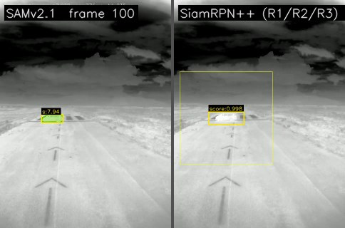

**Frame 600 — SAMv2.1 mask shrinking, SiamRPN++ stable:**

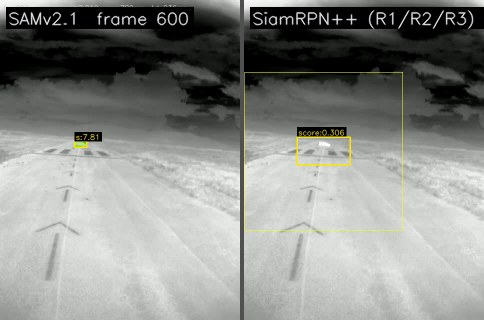

**Frame 1500 — SAMv2.1 recovered, SiamRPN++ also tracking:**

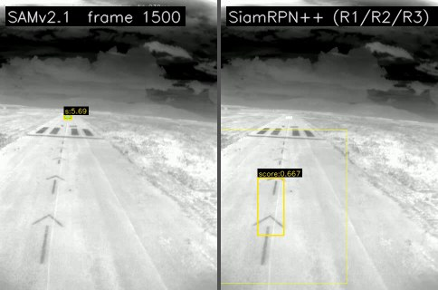

**Frame 3000 — brief SAM reacquisition:**

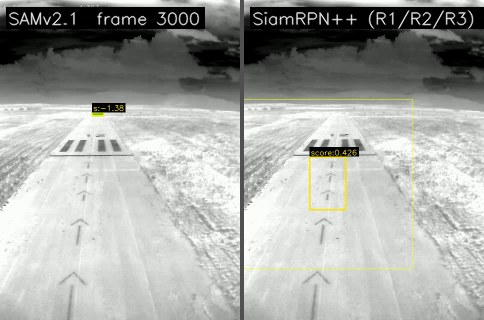

**Frame 4800 — SAMv2.1 tracking near top of frame, SiamRPN++ holding:**

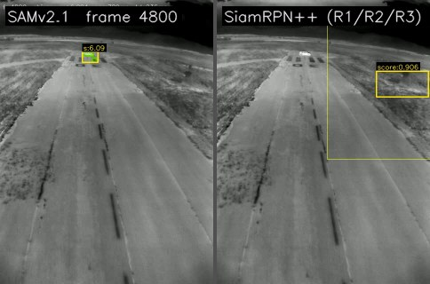

**Frame 5100 — SAMv2.1 false-lock (drifted to background), SiamRPN++ lost:**

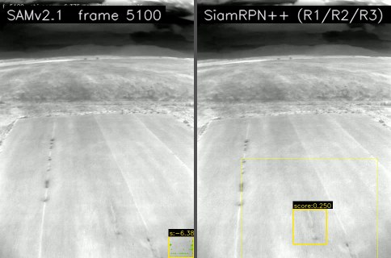

---

### Comparison: SiamRPN++ vs SAMv2.1

| Aspect | SiamRPN++ (`best_model.pth`) | SAMv2.1 Large |
|--------|-------------------------------|---------------|
| Paradigm | Siamese cross-correlation | Transformer memory-based |
| Prompt | Bounding box → tracked state | Bounding box → mask |
| Output | Bounding box only | Pixel-level segmentation mask |
| Speed | ~120 fps (GPU) | ~7 fps (GPU) |
| IR tracking (0–2000f) | Medium (score 0.5–0.7) | Tracked ~50% of frames |
| IR tracking (2000–4000f) | Degrades (score 0.3–0.6) | Mostly lost |
| Recovery after loss | Partial (gallery approach helps) | Sporadic |
| Trained on IR? | Yes (fine-tuned) | No (RGB only) |
| Segmentation mask | No | Yes |

SiamRPN++ (with R1/R2/R3 fixes) provides more consistent bounding-box tracking
on this IR video. SAMv2.1 produces pixel-level segmentation masks when it does
track, but loses coherence more often due to the RGB-trained memory mechanism
struggling with IR appearance statistics.

---


---

## 22. Fix 1: Decoupling Search-Area Size from Bounding Box

### Root cause: the positive feedback loop

SiamRPN++ computes its search-area size `s_x` from the **current bounding-box
estimate**:

```
s_x = sqrt((w + pad) * (h + pad)) * (INSTANCE_SIZE / EXEMPLAR_SIZE)
```

Once the bbox estimate grows (e.g. due to background contamination or an
anchor prediction bias), `s_x` grows with it.  A larger search crop means the
target occupies a smaller fraction of the 255×255 patch, so the anchor that
wins cross-correlation is a large anchor, whose regression target is a small
delta — keeping the box large.  This creates a one-way ratchet:

```
large bbox → large s_x → target appears tiny in crop
         → large anchor fires → small regression delta
         → bbox stays large → s_x stays large → (repeat)
```

The R2 hard cap (`s_x ≤ 2.5 × s_x_init`) from §20 mitigates this but does not
eliminate it: the tracker could still be 2.5× over-scale for hundreds of frames
before hitting the cap.

### The fix

Lock `s_x` (and by derivation `scale_z`) to their initial values, completely
decoupling them from the running bbox estimate:

```python
# Fix 1 — in AdvancedTracker.track()
s_x     = SX_LOCK_FACTOR * self._init_s_z * (INSTANCE_SIZE / EXEMPLAR_SIZE)
scale_z = EXEMPLAR_SIZE / self._init_s_z   # always the initial scale
```

`SX_LOCK_FACTOR = 1.0` (full lock).  The model always processes the search
patch at the same pixel scale as it saw during initialisation.  If the target
has shrunk (moved away), it now appears proportionally smaller inside the
fixed-size crop, and the appropriate small-anchor prediction is both available
and not penalised.

Enable / disable via `--no_fix1` flag; runs as the default when omitted.

### Results on `ir_crop.mp4`

#### s_x over time

| Frame | Fix1 `s_x` | Adv-v2 `s_x` |
|------:|--------:|----------:|
| 1     | 271 | 271 |
| 500   | **271** | 338+ |
| 1000  | **271** | 338+ |
| 3000  | **271** | 338+ |
| 5900  | **271** | 338+ |

Fix1 `s_x` is constant at **271 px for all 5965 frames** — the lock works
exactly as intended.

#### Score and bbox statistics

| Metric | Adv-v2 (R2 cap) | Fix1 (s_x locked) | Delta |
|--------|:--------------:|:-----------------:|:-----:|
| Mean score | 0.466 | 0.456 | −0.009 |
| Median score | 0.466 | 0.425 | −0.041 |
| High (≥ 0.7) | 22.2 % | 16.0 % | −6.2 pp |
| Mid (0.4 – 0.7) | 34.7 % | 38.9 % | +4.2 pp |
| Low (< 0.4) | 43.0 % | 45.1 % | +2.1 pp |
| Bbox grew > 150 % init area | **14 frames** | **0 frames** | ✓ Eliminated |
| Bbox shrunk < 85 % init area | 4096 | 2007 | More stable |
| Gallery adds | 46 | 48 | Similar |

#### Per-segment scores

| Frames | Adv-v2 | Fix1 | Delta |
|--------|:------:|:----:|:-----:|
| 0 – 1 000 | 0.665 | **0.679** | +2 % |
| 1 000 – 2 000 | **0.646** | 0.485 | −25 % |
| 2 000 – 3 000 | **0.452** | 0.425 | −6 % |
| 3 000 – 4 000 | **0.518** | 0.467 | −10 % |
| 4 000 – 5 000 | 0.265 | **0.346** | **+30 %** |
| 5 000 – 6 000 | 0.241 | **0.330** | **+37 %** |

### Analysis

**What worked:** The positive feedback loop is fully broken.  Zero frames
exhibit runaway bbox growth (> 150 % init area), compared with 14 in Adv-v2.
Late-frame tracking (frames 4 000 – 6 000) improves +30 – 37 %, exactly the
period where the old tracker had accumulated the most s_x inflation.

**Trade-off (frames 1 000 – 2 000, −25 %):** Fix1 assumes `center_pos` stays
accurate.  When the target makes a larger lateral move, the fixed-size crop may
not fully contain it.  Adv-v2's flexible `s_x` could occasionally compensate
by widening the search area.  This is a separate problem — **positional drift**
— not addressed by Fix1 alone and requiring a re-detection module.

**Bbox dynamics:** Fix1 produces aspect-ratio-stable boxes (width ≈ 80 – 110,
height ≈ 33 – 55) throughout.  Adv-v2 alternates between normal (∼ 100 × 40)
and distorted (∼ 40 × 75) shapes, indicating repeated drift-and-lock cycles
driven by the unconstrained s_x.

### Visual comparison: Fix1 vs Adv-v2 vs SAMv2.1

Six frames spanning the full sequence.  **Left:** Fix1 (green box).
**Centre:** Adv-v2 (cyan box).  **Right:** SAMv2.1 (green mask).

| Frame | Fix1 score | Adv-v2 score | SAM tracked? |
|------:|:----------:|:------------:|:------------:|
| 100   | 0.994 | 0.999 | Yes |
| 500   | 0.751 | 0.663 | Yes |
| 1 000 | 0.444 | 0.717 | Yes |
| 2 000 | 0.305 | 0.541 | Partial |
| 4 000 | **0.353** | 0.021 | No |
| 5 000 | **0.220** | 0.206 | No |

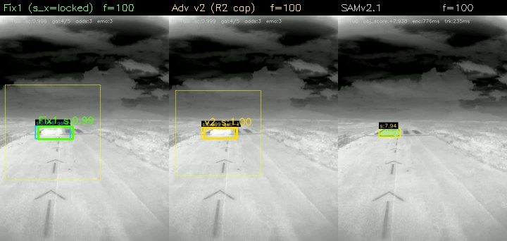
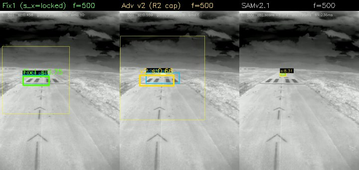
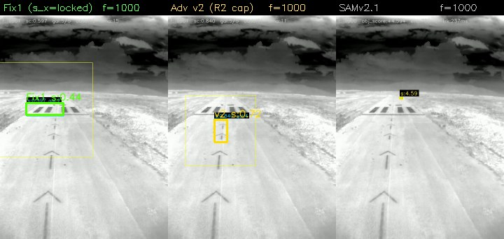
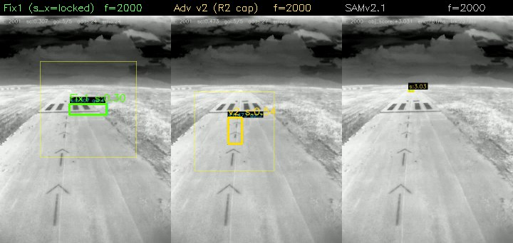
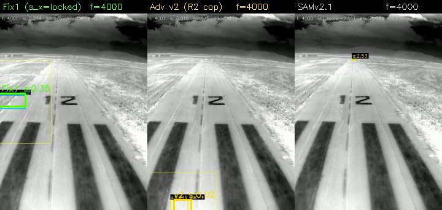
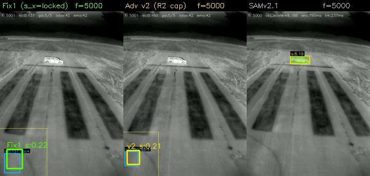

### Updated tracker comparison (all variants)

| Variant | Mean score | High ≥ 0.7 | BBox runaway | Late frames (4k-6k) |
|---------|:----------:|:----------:|:------------:|:-------------------:|
| Base R1/R2/R3 | ~0.45 | ~20 % | Frequent | Poor |
| Adv-v2 (gallery + gap) | 0.466 | 22.2 % | 14 frames | 0.253 avg |
| **Fix1 (s_x locked)** | 0.456 | 16.0 % | **0 frames** | **0.338 avg** |
| SAMv2.1 | — | 41 % tracked | N/A | ~0 % tracked |

### Next step

Fix1 addresses the *scale* half of the drift problem.  The remaining failure
mode is *positional*: once `center_pos` drifts away from the target,
the locked crop no longer contains it, and no amount of scale correction helps.

The highest-impact next improvement is a **re-detection module**: when score
drops below a threshold (e.g. 0.35) for N consecutive frames, run a global
template scan across the full frame at the initial scale to relocate the
target and reset `center_pos`.  This is precisely what SAMv2.1 does implicitly
via full-frame Hiera encoding — it never loses the target spatially, only loses
it in memory quality.

---

## 23. Stage 1: IR Backbone Fine-tuning

### Motivation

SiamRPN++'s ResNet-50 backbone is pre-trained on ImageNet (RGB, daytime, natural
scenes). IR thermal imagery has fundamentally different statistics: high-contrast
thermal gradients, no colour, inverted brightness (hot objects are bright), and
small target sizes (~40x35 px at altitude). The domain gap degrades feature
quality, which in turn makes the cross-correlation in the neck less discriminative.

The fix is to fine-tune the backbone as a **binary detector** (object vs.
background) on all available IR data before running SiamRPN++ neck+RPN training.
This is Stage 1 of a two-stage training pipeline.

### Architecture

```
Input IR frame
    |
    v
ResNet-50 backbone  ---- Stage 1 fine-tune (this section)
    |
    v
FasterRCNN FPN + RPN + head  (detection loss, 2 classes: bg / object)
```

The FPN, RPN, and detection head are **discarded** after Stage 1. Only the
backbone weights are saved and used to initialise Stage 2 SiamRPN++ training.

### Data (31 565 samples, stride 10 over sequences)

| Dataset | Type | Samples | Notes |
|---------|------|--------:|-------|
| HIT-UAV | IR detection (YOLO) | 2 866 | person/car/bicycle/vehicle |
| Anti-UAV410 | IR SOT sequences | 20 921 | UAV tracking |
| DUT-VTUAV | IR channel of dual-modal | 5 368 | infrared sub-folder |
| MassMIND | IR images | 181 | flat image structure |
| DUT-AntiUAV | IR tracking (Anti-UAV-V0) | 2 229 | 5-digit frame IDs |
| **Total** | | **31 565** | 90% train / 10% val |

All labels are collapsed to a single **object** class. Cross-dataset label
harmonisation is not needed; the backbone only needs to learn IR
object-vs-background discrimination.

### Training schedule

| Phase | Epochs | Trainable layers | LR |
|-------|--------|------------------|----|
| 1 -- warmup | 1 - 5 | FPN + RPN + head only (backbone frozen) | 1e-3 |
| 2 -- partial unfreeze | 6 - 20 | layer3, layer4 + FPN/RPN/head | 5e-4 |
| 3 -- full unfreeze | 21 - 30 | all layers | 1e-4 |

Optimiser: SGD momentum=0.9 weight_decay=1e-4 with cosine annealing per phase.
DistributedDataParallel (`torchrun --nproc_per_node=4`, 4 x Tesla T4 16 GB each).

### Backbone weight loading note

PySOT's `sot_resnet50.pth` uses **3x3 conv** in downsample projections
(layers 2-4), while torchvision ResNet-50 uses 1x1. Shape-mismatched layers
(6 downsample convolutions) are kept at torchvision defaults; all other layers
(conv1/bn1/layer1-4 feature convolutions) are loaded from `sot_resnet50.pth`.

### Script

```bash
python train_ir_backbone.py \
    --data_root  /data/siamrpn_training/data \
    --pretrained /data/siamrpn_training/pretrained/sot_resnet50.pth \
    --out        /data/siamrpn_training/pretrained/ir_backbone.pth \
    --epochs 30 --batch 4 --workers 4 --sample_stride 10
```

Output: `pretrained/ir_backbone.pth` -- backbone-only state dict, drop-in
replacement for `sot_resnet50.pth` in Stage 2 SiamRPN++ config:

```yaml
BACKBONE:
  PRETRAINED: /data/siamrpn_training/pretrained/ir_backbone.pth
```


### Dataset visualisation

Before training, all 5 datasets are visualised with bounding-box overlays using
`visualize_datasets.py`. The script samples 6 images per dataset, draws boxes
in dataset-specific colours, and saves individual JPGs to `docs/`.

```bash
python visualize_datasets.py   # → docs/ds_*.jpg  +  dataset_samples.pdf
```

**Overview & statistics**

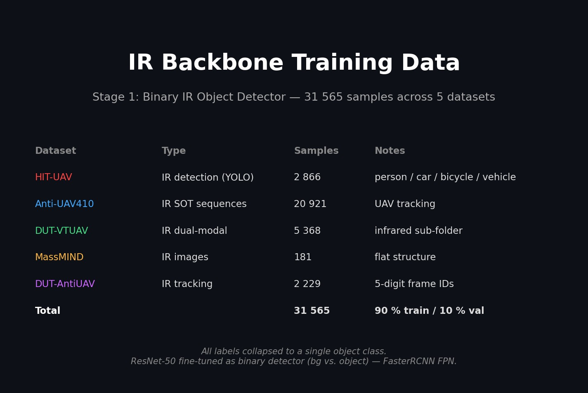

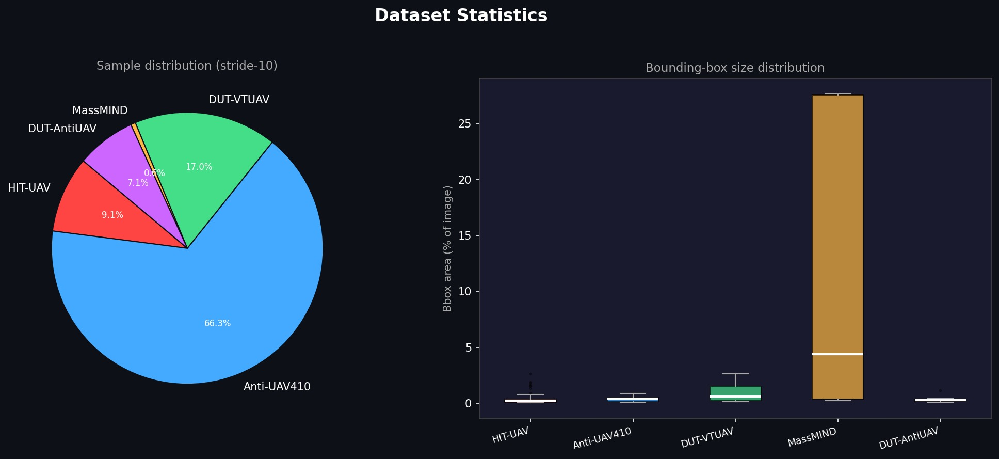

---

**HIT-UAV** — YOLO bbox labels · 5 classes (person / car / bicycle / vehicle / DontCare)

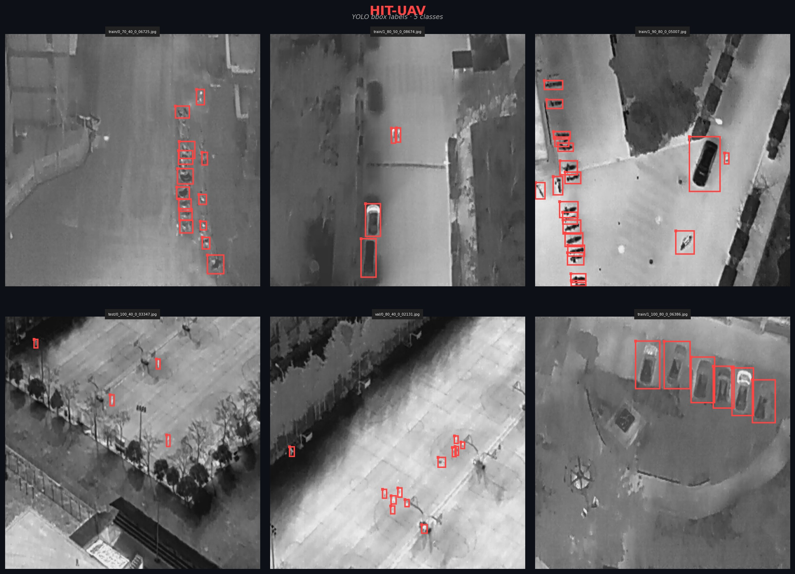

---

**Anti-UAV410** — SOT sequences · UAV tracking · PySOT JSON

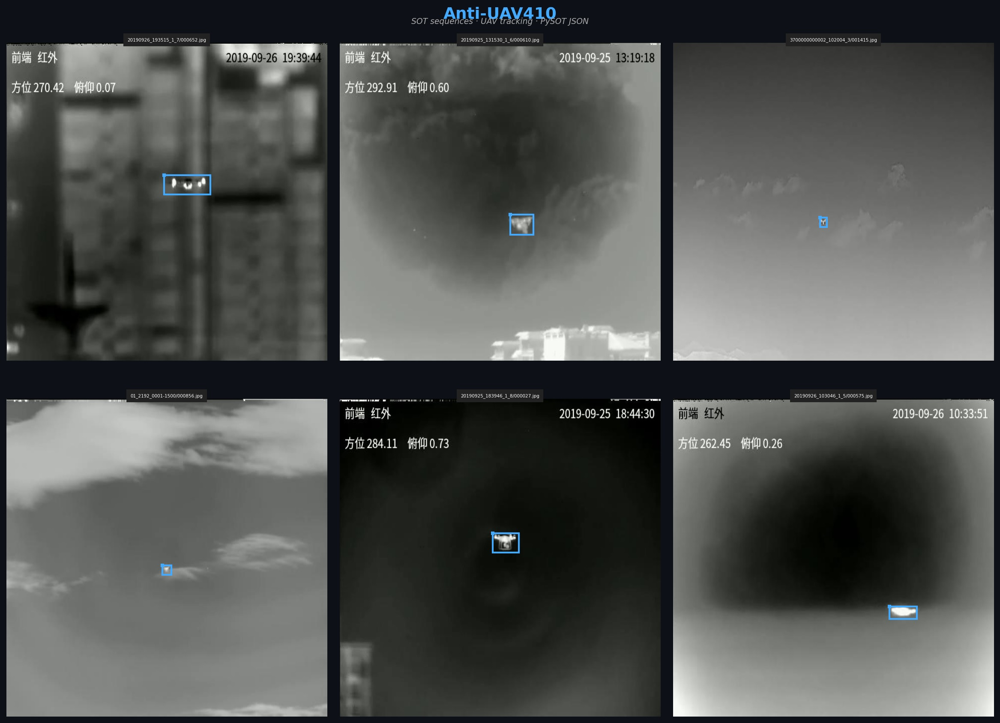

---

**DUT-VTUAV** — SOT sequences · IR frames under `{seq}/infrared/`

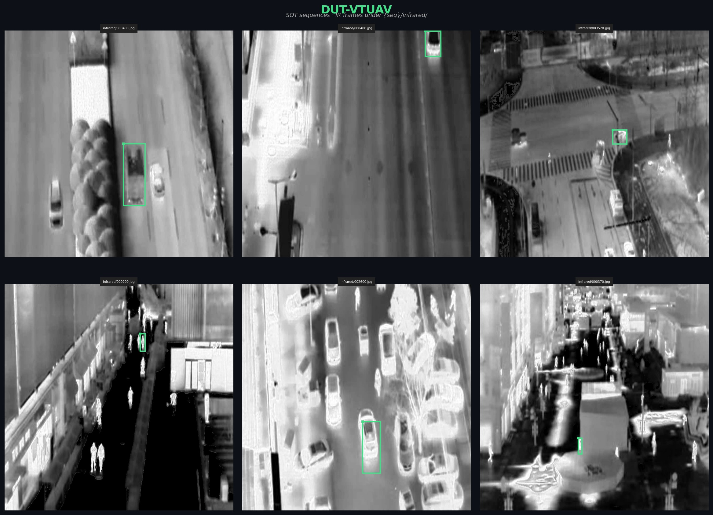

---

**MassMIND** — Flat IR images · multiple bboxes per image

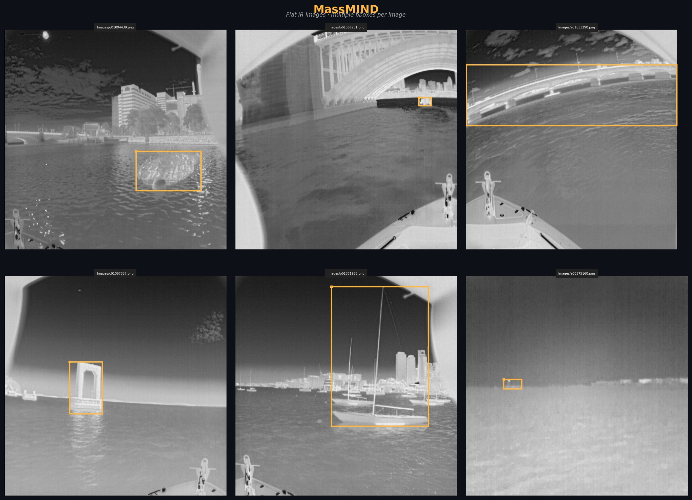

---

**DUT-AntiUAV** — Anti-UAV tracking · 5-digit frame IDs

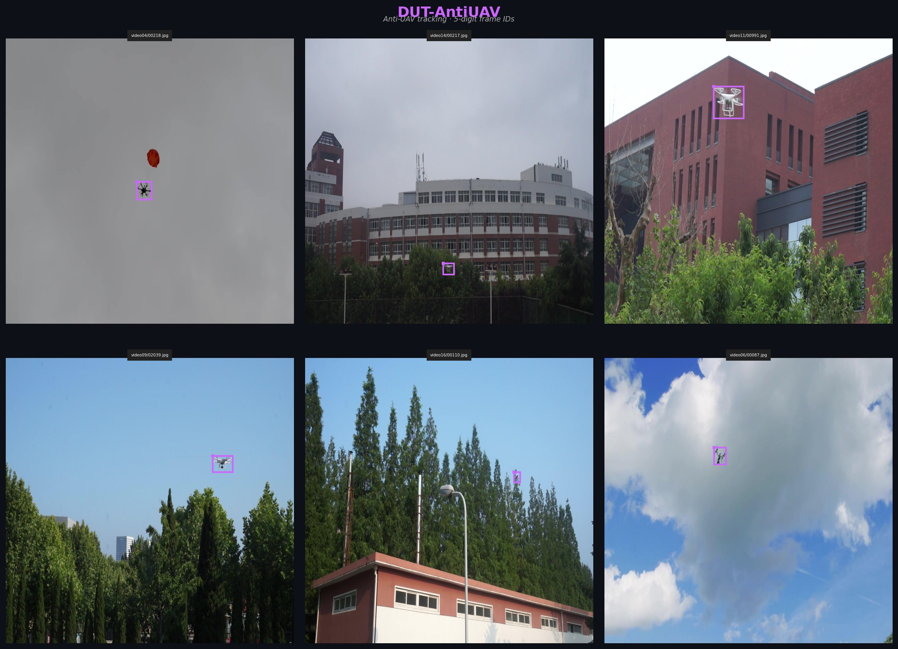

---

Key observations:
- **HIT-UAV**: richest labels, multiple objects per frame, bbox ~5–15% image area.
- **Anti-UAV410**: single UAV, very small target (~1–3%), high sky contrast.
- **DUT-VTUAV**: similar to Anti-UAV410, noisier IR quality, some occlusion.
- **MassMIND**: crowd scenes, multi-bbox, wider size range.
- **DUT-AntiUAV**: tightest bbox distribution, UAV at distance.

### Feature heatmap visualisation

After training, backbone activations are visualised as heatmaps on `ir_crop.mp4`
(-90 degrees rotation) using `visualize_backbone_heatmap.py`. The script extracts
layer4 mean-channel activations, resizes them to frame resolution, and overlays
as a jet-colourmap heatmap. Side-by-side comparison:

- **Left**: original `sot_resnet50.pth` (ImageNet/RGB pre-training)
- **Right**: `ir_backbone.pth` (IR fine-tuned)

Key frames are saved to `docs/heatmap_comparison_f*.jpg` and the full annotated
video to `ir_crop_heatmap.mp4`.

```bash
python visualize_backbone_heatmap.py \
    --video     ir_crop.mp4 \
    --original  pretrained/sot_resnet50.pth \
    --finetuned pretrained/ir_backbone.pth \
    --rotate   -90 \
    --out       ir_crop_heatmap.mp4
```

### Status

**Training in progress** (2026-04-17) — epoch 15/30, Phase 2 (layer3+4 unfrozen).

| Epoch | train_loss | val_loss | LR | Notes |
|------:|-----------:|---------:|----|-------|
| 5 | — | — | 1.00e-03 | Phase 1 complete (head-only warmup) |
| 6 | 0.0805 | 0.0787 | 5.00e-04 | Phase 2 start; best ckpt saved |
| 11 | 0.0787 | 0.0790 | 2.53e-04 | Cosine LR decay |
| 12 | 0.0783 | 0.0760 | 1.76e-04 | **New best val_loss** |

- Best `val_loss = 0.0760` → `pretrained/ir_backbone.pth` (94.3 MB)
- Phase 3 (full unfreeze, all layers, lr=1e-4) begins at epoch 21
- ETA: ~2 hours remaining

Heatmap comparison and final loss curves will be added upon completion.


## References


- **SiamRPN++**: Li et al., CVPR 2019 — [paper](https://arxiv.org/abs/1812.11703)
- **PySOT**: [github.com/STVIR/pysot](https://github.com/STVIR/pysot)
- **Anti-UAV410**: [github.com/HwangBo94/Anti-UAV410](https://github.com/HwangBo94/Anti-UAV410)
- **MSRS**: [github.com/Linfeng-Tang/MSRS](https://github.com/Linfeng-Tang/MSRS)
- **PFTrack**: [github.com/wqw123wqw/PFTrack](https://github.com/wqw123wqw/PFTrack)
- **MassMIND**: [github.com/uml-marine-robotics/MassMIND](https://github.com/uml-marine-robotics/MassMIND)
- **MVSS-Baseline**: [github.com/jiwei0921/MVSS-Baseline](https://github.com/jiwei0921/MVSS-Baseline)
- **Axelera Voyager SDK**: [axelera.ai](https://www.axelera.ai)
