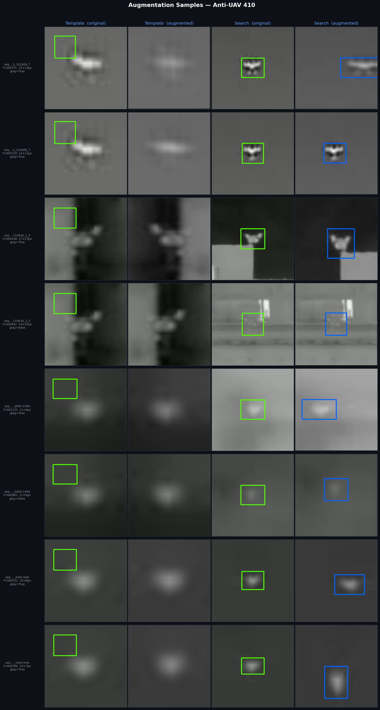
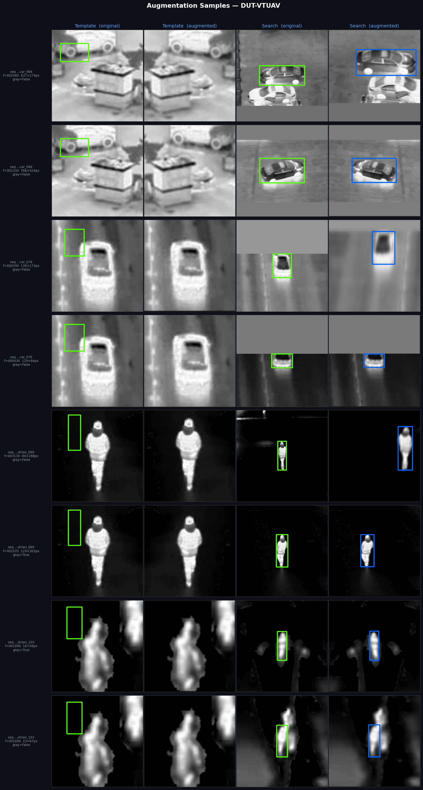

# IR SiamRPN++ Training Data & Config

## Dataset Summary

The training config (`config_ir_siamese.yaml`) registers 7 IR datasets.
Only 2 have annotation JSONs generated — the loader silently skips the rest.
MSRS and MASSMIND were removed from the config (avg seq len = 2 frames, no motion signal).

### Active Datasets (used in training)

| Dataset | Sequences | Total Frames | Avg Seq Len | Frame Range | Weight |
|---|---:|---:|---:|---:|---:|
| Anti-UAV 410 | 200 | 208,832 | 1044 | 50 | 3.0 |
| DUT-VTUAV | 225 | 52,640 | 234 | 50 | 2.5 |
| **Total** | **425** | **261,472** | ~615 | — | — |

`VIDEOS_PER_EPOCH = 10000` (sampled with replacement, weighted by the above).

### Datasets Not Used (missing `train_pysot.json`)

| Dataset | Status | Intended Weight | Frame Range |
|---|---|---:|---:|
| VTMOT | directory missing | 2.0 | 30 |
| MVSS | dir exists, no JSON | 1.5 | 20 |
| Anti-UAV 300 | dir exists, no JSON | 2.5 | 50 |
| BirdSAI | dir exists, no JSON | 1.5 | 30 |
| HIT-UAV | dir exists, no JSON | 1.0 | 5 |

### Removed from Config

| Dataset | Reason |
|---|---|
| MSRS | Avg seq len = 2 frames — no temporal motion signal |
| MASSMIND | Avg seq len = 2 frames — no temporal motion signal |

---

## Target Object Size Analysis

SAM2 segmentation masks on `ir_crop.mp4` (545 frames with valid mask):

| Metric | Width (px) | Height (px) | Area (px²) |
|---|---:|---:|---:|
| min | 2 | 2 | 4 |
| p25 | 6 | 4 | 24 |
| **median** | **12** | **6** | **72** |
| p75 | 22 | 14 | 300 |
| p95 | 170 | 240 | 33,994 |
| max | 478 | 636 | 302,736 |

**Area distribution:**
- 28% of frames: < 25 px² (sub-5px targets)
- 31% of frames: 25–100 px² (core UAV regime)
- 18% of frames: 100–400 px²
- 13% of frames: > 1,600 px² (false target — ground vehicle)

The p95 spike is caused by SAM2 latching onto a large ground vehicle entering the frame (~frame 5000), not the UAV.

---

## Augmentation Config

All changes applied to `config_ir_siamese.yaml` for tiny IR target tracking (2–20px targets).

### Template (127×127)

| Parameter | Old | New | Reason |
|---|---|---|---|
| SCALE | 0.05 | **0.10** | Cover ±1–2px annotation error on tiny targets |
| BLUR | 0.0 | **0.2** | IR optics blur small targets naturally |
| FLIP | 0.0 | **0.5** | Aerial scene — left/right symmetric |
| COLOR | 1.0 | **0.0** | Disable ImageNet PCA jitter — wrong for IR |
| SHIFT | 4 | 4 | Unchanged |

### Search (255×255)

| Parameter | Old | New | Reason |
|---|---|---|---|
| SCALE | 0.18 | **0.50** | Cover 10× linear scale range of target |
| BLUR | 0.0 | **0.3** | Match real IR blur characteristics |
| FLIP | 0.0 | **0.5** | Consistent with template flip |
| COLOR | 1.0 | **0.0** | Disable ImageNet PCA jitter — wrong for IR |
| SHIFT | 64 | 64 | Unchanged |

### Dataset-level

| Parameter | Old | New | Reason |
|---|---|---|---|
| NEG | 0.2 | **0.4** | Clutter hard to distinguish from 2–12px target |
| GRAY | 0.0 | **0.5** | IR is single-channel — grayscale augmentation appropriate |

### Notes

- **COLOR disabled**: The PCA `rgbVar` matrix was estimated from ImageNet RGB statistics. IR imagery is single-channel intensity mapped to BGR — the eigenvectors have no physical meaning and add random incorrect colour shifts.
- **SCALE 0.18→0.50 on search**: Target ranges 2–20px across the video (100× area change). A ±18% crop scale covers only a 0.8–1.2× linear factor per frame pair; ±50% covers the realistic inter-frame scale variation over a 50-frame gap.
- **Template scale capped at 0.10**: The template is the fixed reference — aggressive jitter corrupts the cross-correlation anchor. 0.10 covers annotation imprecision without distorting appearance.

### Augmentation Samples

Each row: **Template original | Template augmented | Search original | Search augmented**.
Green box = ground-truth bbox. Orange/blue box = augmented bbox after shift+scale.

**Anti-UAV 410** (8–27px targets, aerial IR UAV):



**DUT-VTUAV** (18–766px targets, aerial IR ground vehicles and pedestrians):



Full PDF with all samples: [`docs/augmentation/augmentation_samples.pdf`](docs/augmentation/augmentation_samples.pdf)

---

## Notes

- **Anti-UAV 410 dominates**: 80% of all training frames, up-weighted 3×. The model is strongly biased toward this domain (aerial IR, small UAV targets).
- **DUT-VTUAV**: remaining 20% of frames. Good UAV-from-UAV aerial IR with long sequences.
- **5 datasets were never converted** to PySOT JSON format. Adding them (particularly Anti-UAV 300, VTMOT, BirdSAI) would meaningfully diversify training data and likely improve robustness on small/fast targets.

---

## Data Locations

```
/data/siamrpn_training/data/
  anti_uav410/       train_pysot.json  val_pysot.json   [ACTIVE]
  dut_vtuav/         train_pysot.json  test_pysot.json  [ACTIVE]
  anti_uav300/       (no JSON)
  birdsai/           (no JSON)
  hit_uav/           (no JSON)
  mvss/              (no JSON)
  msrs/              (removed from config)
  massmind/          (removed from config)
  dut_anti_uav/      (not configured — RGB, not IR)
```

Config: `/data/siamrpn_training/pysot/experiments/siamrpn_r50_alldatasets/config_ir_siamese.yaml`
